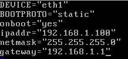
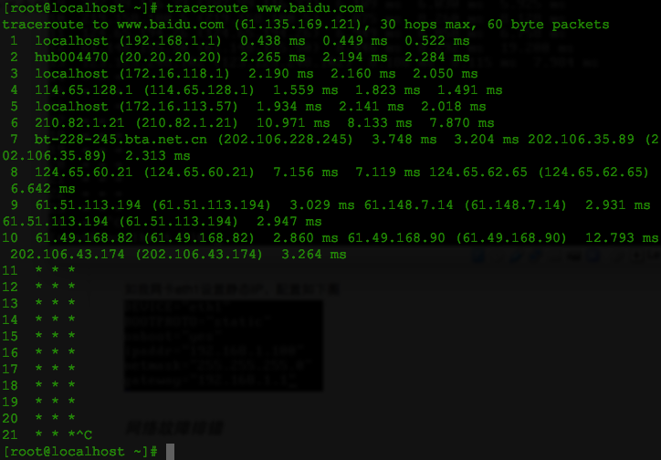
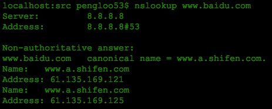
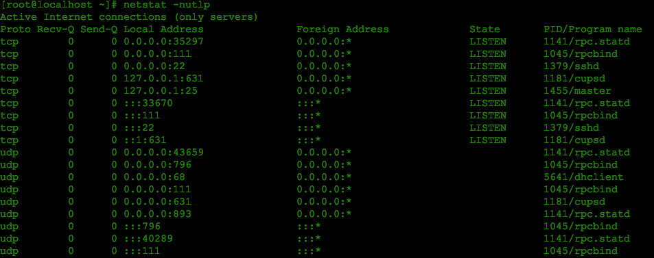

**忘记root登录密码，怎么办？**

1. 开机出现GRUB引导程序时，按`e`编辑GRUB引导参数
2. 选择以kernel开始的行按`e`进行编辑
3. 在kernel行末尾加上single后回车，按`b`启动系统进入单用户模式
4. 在单用户模式下输入命令`passwd root`，输入两次密码
5. 修改成功，`shutdown -r now`重启系统
6. 新密码登入，成功。

-  `history`命令显示所有命令记录，然后通过`!命令编号`调用该命令
-  清屏命令大家都知道`clear`，还有一个快捷键更方便——`ctrl+l`
-  Vim普通模式下输入`ZZ`，可以实现保存并退出文档
-  `echo "hello123" | passwd --stdin jack` 通过管道为用户jack设置密码
- `uptime` 监控CPU使用情况

## 一、ACL访问控制权限
两个命令：`getfacl`、`setfacl`

- `getfacl` 查看文档的ACL权限
- `setfacl` 设置文档ACL权限
	- `-b` 删除所有附加的ACL条目
	- `-k` 删除默认的ACL
	- `-m` 添加ACL权限
	- `-x` 删除指定的ACL条目
	- `-R` 递归处理所有的子文件与子目录

**示例**
- `getfacl  2.log` 查看文档2.log的ACL权限
- `setfacl -m u:user01:rw 2.log` 添加ACL条目，使用户user01对2.log文件可读可写
- `setfacl -m g:group01:r 2.log` 使用户组group01对文件2.log有可写权限
- `setfacl -x u:user01 2.log` 删除用户user01的ACL条目
- `setfacl -x g:group01 2.log` 删除组的权限
- `setfacl -b 2.log` 清除文件2.log所有ACL权限
	
## 二、磁盘分区
之前在一篇笔记里已经介绍了`fdisk`命令的用法，这里就不重复了，这里说一下另外两个命令`partprobe`和`parted`。

- `partprobe /dev/sdb` 让内核立即读取新的分区表，无需重启电脑就可以识别新创建的分区
- `parted` GPT分区方式，不同与传统的MBR分区（使用`fdisk`）

## 三、开机启动
学习开机启动命令，先要了解Linux的6种运行级别。

- 0 关机模式
- 1 单用户模式
- 2 无NFS（共享服务）网络的字符界面模式
- 3 全功能字符界面模式
- 4 暂时未定义使用
- 5 图形模式
- 6 重启模式

通过`runlevel`命令可以查看当前所处的运行级别。服务器版本的Linux一般都是3级别，通过`init`命令可以改变当前的运行级别，如`init 0`命令可以直接关机.

好了，可以进入正题了，如何设置开机启动呢？使用命令`chkconfig`，用法如下：

- `chkconfig --list` 查询系统服务运行级别信息
- `chkconfig --level` 指定操作的运行级别，不指定级别时默认为2，3，4，5级别
- 实例：
	- `chkconfig --list sshd` 查看sshd命令的运行级别    
	 
	- `chkconfig sshd on` 设置sshd服务在2.3.4.5级别开机启动  
	
	
## 四、内存和硬盘使用情况
### 1、内存使用
内存的使用情况查看命令，应该很熟悉了，那就是`free`，但是你真的知道显示出来的各个数据都代表的是什么意思吗？至少之前我是没怎么去了解。

每次看的时候，也就扫了一眼，总共`498M`，用了`263M`，还剩`235M`，就完事了。其他的数据就没怎么看了，这里简单介绍一下其他数是什么含义。

在Linux开机后就会预先提取一部分内存，并划为buffer与cache以供进程随时使用。第一行的used就是这部分内存数`263`，而后面的buffers代表的是buffer使用剩余的内存数`65`，cached就是cache剩余的内存数`145`。那么buffer和cache用了多少呢？第二行中used就是buffer和cache使用的内存数`51`，那么就有等式`263=65+145+51`，接下来`446`系统总剩余的内存数，为分配的有`235`，分配了但是没有用完的有`65+145`，那么`446=65+145+235`。

*细心的读者也许一眼就看出了，等式根本不等嘛！别着急，换成字节单位，你再算算！至于原因就很明了了*

### 2、硬盘使用
这里就补充两点。

1、`df -hT`中`T`的参数代表显示文件系统

2、`df -i`中 `i`代表的是磁盘inode使用量信息
 

这里可以看出根分区还剩下313077个inode节点，也就是说如果在更分区下创建313077个空文件，那么就算该磁盘还有容量也再也容不下新增文件了。

## 五、网络
### 1、网络参数设置
有两种方式设置网络参数，一是通过命令行设置；二是通过修改参数文件。

命令行设置不外乎`ifconfig`、`route`这两个命令，具体使用可以自行查询帮助文档，这里介绍一下修改参数文件来设置网络。

网络的参数文件在`/etc/sysconfig/network-scripts/ifcfg-<iface>`，其中`iface`为网卡接口名称。如果只有一块以太网网卡，则一般为`ifcfg-eth0`，文件有一下字段：

- `DEVICE` 设备名称 `eh0,eth1...`
- `TYPE` 设备类型 `ethernet`
- `BOOTPROTO` 启动协议 `none|dhcp|static`
- `HWADDR` 硬件地址 MAC地址
- `NM_CONTROLLED` 网卡是否可以被NetworkManager控制 `yes|no`
- `ONBOOT` 开机是否启动该网卡 `yes|no`
- `ONPARENT` 真实接口启动后虚拟接口是否启动 `yes|no`
- `IPADDR` IP地址
- `PREFIX` 网络位掩码个数
- `NETMASK` 子网掩码
- `GATEWAY` 默认网关
- `DNS{1,2}` DNS服务器

如我网卡eth1设置静态IP，配置如下图

### 2、网络故障排错

这块主要介绍5个命令，`ping`、`traceroute`、`nslookup`、`dig`、`netstat`。

**`ping` 非常常用的命令，测试基本如下步骤**
1. `ping 127.0.0.1` ping本地回环，测试本地网络协议是否正常
2. `ping 192.168.1.101` ping本地IP，测试本地网络接口是否正常
3. `ping 192.168.1.1` ping本地网关，测试网关是否正常工作
4. `ping 61.135.169.121` ping外部网络，测试服务商网络是否正常工作
5. `ping www.baidu.com` ping网址，如果上述都正常，而这步ping不通，那么肯定是DNS的问题了
	
**`traceroute` 跟踪数据包的路由过程**

	
**`nslookup` 检测本地设置的DNS服务器工作是否正常**

`nslookup www.baidu.com` 检测本地DNS服务器是否能解析到百度，本地设置的DNS服务器是8.8.8.8，检测到百度对应的两个IP地址

    
	
**`dig` 查看更多关于DNS记录的信息**

`dig www.baidu.com` 能显示比`nslookup`更详细的信息
	
**`netstat` 网络监控命令**  
该命令比较强大，可以自行查看帮助文档学习，`netstat -nutlp` 查看当前系统开启端口信息。

