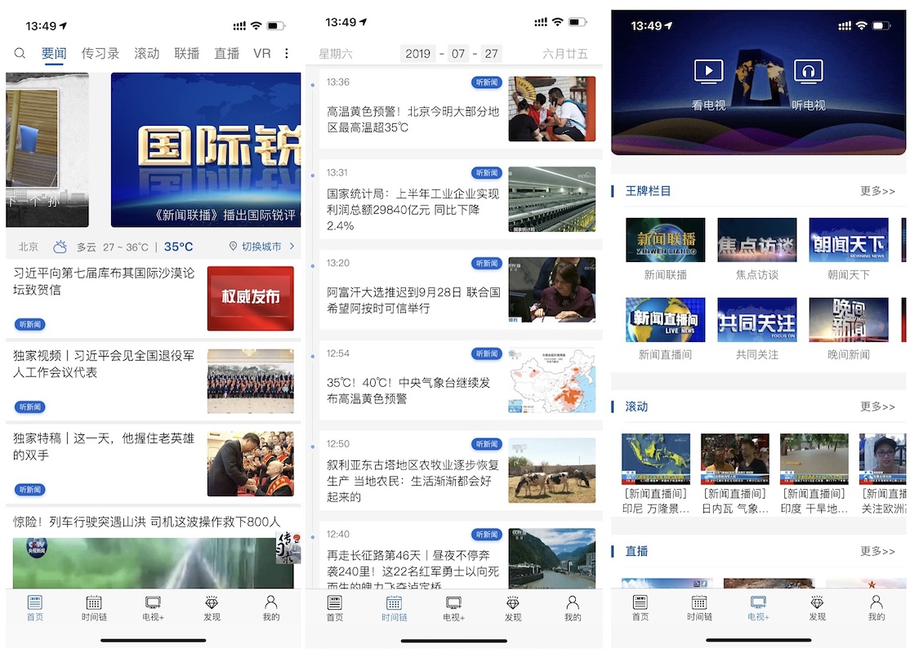
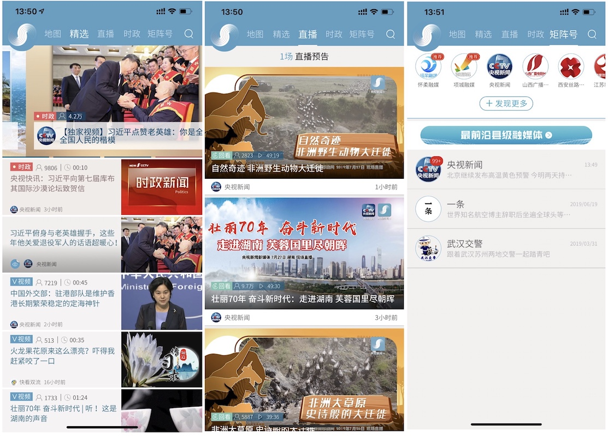

前段时间，我参加了[中央广播电视总台产品经理岗位的应聘](/2019/07/26/employ-producter)，有幸进入了二面，在准备二面的时候，抽空了解了下央视新闻的两个 APP，在这里，简单谈一下，我对它们的理解。

> 需要声明的是，这仅仅是作者个人片面的理解，仅作参考。

### 背景
想要了解其产品，首先要了解它的组织背景。中央广播电视总台是在 2018 年 3 月份成立的，它是由「中央电视台」「中国国际电视台」「中央人民广播电台」「中国国际广播电台」合并组成。它的业务上级就是中共中央宣传部，简称「中宣部」，「学习强国」APP 就是出自它们。

根据官方介绍，其成立的背景，我归纳有如下几点：

1. 坚持正确的舆论导向
2. 加快传播手段的建设与创新
3. 提高舆论传播力、引导力、影响力及公信力等
4. 促进传统广播电视媒体与新兴媒体的融合发展

### 新闻产品的价值
根据中央广播电视总台的背景，针对其新闻产品的价值点，我大概总结为 3 个词：**质量，传播，体验**。

- 质量，指的就是正确的舆论导向，这个没什么可说的，新闻内容的价值观一定要符合中国特色社会主义，这是肯定的
- 传播，一方面指的是传播手段的创新，也就是与移动互联网和物联网技术的结合；另一方面指的是新闻传播的效率，对于新闻类 APP， 传播覆盖率应该是一个重要的指标；
- 体验，指的就是用户体验，新闻类 APP 除了新闻内容外，用户体验也同样重要，实现传统媒体与新兴媒体的融合发展，不应该仅仅只是将传统媒体搬到移动互联网上，更应该考虑用户体验问题，才能达到更好的效果。

### 新闻产品的模式
当前新闻媒体有两种主流的模式：媒体模式以及聚合模式。

* 媒体模式以门户新闻网站为代表，例如腾讯新闻、网易新闻、新浪新闻以及搜狐新闻等，内容以 PGC 为主，有专业的编辑团队进行内容输入
* 聚合模式以今日头条类 APP 为代表，内容由机器抓取和 UGC 完成。每个人都可以成为内容生产者

媒体模式的内容质量较高，当然其生产成本也较高，但是，用户体验可能就差点，因为所呈现的内容，可能并不是用户所需要的。

而基于用户推荐的需求，就出现了今日头条类的新闻产品，它们通过推荐算法，给用户推送他们喜欢的新闻内容，我们称这种方式为「聚合模式」。

这类 APP 都会提供一个创作者平台，每一个用户都可以成为内容发布者，也就是常说的 UGC。这个模式的缺点也很明显，那就是内容质量，内容的生产成本低，势必会出现质量问题，而对于新闻媒体来说，质量是至关重要的。如何做好内容质量审核，一直是这类平台的重点关注内容。

### 产品分析
央视新闻媒体，同时采用了这两种模式。「央视新闻」APP 主要是媒体模式；而「央视新闻+」APP 则采用聚合模式。

媒体模式应该是传统新闻媒体行业比较擅长的一种模式。所以，「央视新闻」APP 给我的感觉还是很不错的，在内容上，以及用户体验上，都还不错。如果非要挑问题的，就是每条新闻上都有一个「听新闻」的蓝色 Label，一度让我很困惑，后来才发现这是一个播放按钮，点击会以音频的方式播放新闻。挺好的一个功能， 被一个小设计搞砸了，将其替换成一个播放按钮的样式，应该是很简单的事。

上图是这个 APP 的界面，页面设计以及结构框架都中规中矩。

- 首页，展示的是各个新闻栏目，叫栏目也不太恰当，因为这个分类有点随意，例如：北京，直播，VR，财经......，这些都不是一个维度的分类，但都当作并列的标签来展示了，不过这并不影响新闻内容的观看以及传播
- 时间链，这个一个不错的功能点，它可以查看历史上任意一天的新闻内容，可以作为除搜索外，另一种信息检索的方式，可以快速定位到某一天某一时刻的新闻
- 电视+，就是将传统电视媒体的内容，全部搬到了手机端，在上面可以查看 CCTV 的各个频道的所有栏目，可以让你在 APP 上就能观看传统电视媒体，这也许是所谓的新旧媒体融合的一种方式吧，但感觉远远不够

总体来说，这个产品的结构还是非常清晰的，用户体验也不错，如果想要获取国家新闻内容，当然首推它了。

另外一个 APP 是「央视新闻+ 」，这个 APP 应该定位的是聚合模式，聚合什么呢？央视新闻只是其中的一个媒体机构，除了央视的新闻媒体，全国各地区县政府等等，应该都有各自的宣传渠道，这个 APP 应该是想打造一个媒体平台，类似于公众号。区县媒体机构可以通过这个平台，发布新闻内容。

但是，从这个 APP 现状来看，应该是没有做起来，界面比较单一，而且结构有点混乱，甚至让我怀疑它的定位到底是不是要做聚合。

聚合模式有两个非常关键的点：一个是内容创作平台，另一个是推荐算法。

在 APP 上有一个叫「矩阵号」的标签，里面有类似于「头条号」一样的个人或是官方媒体。入驻了一些区县级新闻媒体机构，当然，央视新闻是其中主要的一个媒体机构。

有了新闻内容输入，下一步应该是做聚合推荐，给用户推荐新闻内容。但是，这一点，在这个 APP 上没有体现，首页有个「精选」的标签，它的精选逻辑不得而知，如果只是根据时间线罗列的话，那么这个聚合就没有太大的意义。

整体来说，这个 APP 感觉是个半成品，定位不太清晰，如何不是定位聚合模式，那么它与央视新闻 APP 的区别是什么？如果定位是做聚合推荐，那么最核心的推荐功能都没有做，有点尴尬。

基于上面的分析，下一步「央视新闻+」 这个 APP 可能有两个方面要加强：一方面，打造基于机器学习的新闻推荐系统，同时，优化界面，提升用户体验，让用户看到自己想看的新闻内容；另一方面，完善内容创作平台，邀请更多的区县媒体，或是有影响力的组织媒体加入，夯实内容平台数据。做好这两点，才能算作是一个合格的聚合媒体产品。

以上，仅仅是我个人使用这两款 APP 后的产品分析，分享给你。

完。