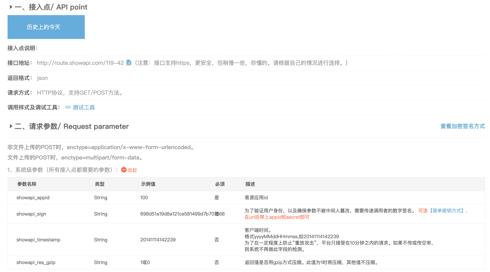
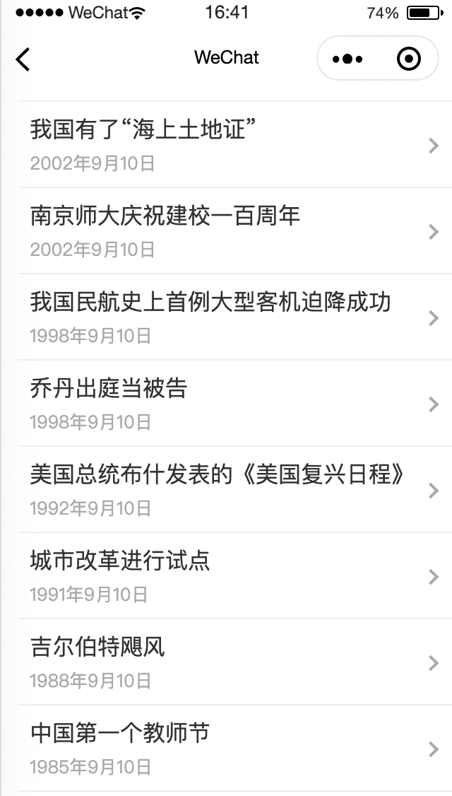

了解完前面的那些内容，动手能力强的，基本上就可以完成很多类别的小程序了。

今天这篇文章进入一个新的领域，开始进入网络开发，前面的内容都是不需要有**服务器（后台）**的概念的。因为所有功能都在小程序端就解决了，数据也只是使用的缓存。

如果要实现一些比较复杂的小程序，服务器的使用肯定是绕不开的一个环节，在微信小程序中，通常有如下 3 种方式，进行后台服务端的开发。

1. 真正意义上的第三方，使用**非自己**，**非微信官方**的接口；
2. 使用微信小程序的**云开发**能力；
3. 自己搭建服务器，给小程序提供服务端接口；

它们的开发难度是 1 > 2 > 3，1 和 3 在小程序端的开发并无差异，只是 3 可能需要全栈开发能力，才能驾驭。

微信官方提供的[网络 API 文档](https://developers.weixin.qq.com/miniprogram/dev/api/network/request/wx.request.html)，有如下 4 类：请求数据（request），下载文件（downloadFile），上传文件（uploadFile），WebSocket。

今天这篇文章，就来介绍一下，如何在小程序中使用 request 获取第三方的数据？

### 开发实战
我们要使用的是[易源接口](https://www.showapi.com/)提供的数据 API — 历史上的今天。

首先在项目目录中，新建 request 目录，并新建 Page index，页面代码如下：

```html
<block wx:for="{{ lists }}" wx:key="{{ index }}">
  <view class="list">
    <view class="title">{{ item.title }}</view>
    <view class="desc">{{ item.year }}年{{ item.month }}月{{ item.day }}日</view>
    <view class="access"></view>
  </view>
</block>
```

很简单，就是一个列表样式，传入 lists 值，用来展示「历史上的今天」的事件。

接下来就是请求第三方的 API 数据了，先看一下易源的接口文档：[历史上的今天-易源接口文档](https://www.showapi.com/apiGateway/view?apiCode=119)，大致内容如下图：



接口返回格式为 json，请求数据需要 4 个参数，这是为了校验，需要我们注册账户才可以获取。

这里重点是要知道，返回数据的 json 结构，如下：

```json
{
  "showapi_res_code": 0,
  "showapi_res_error": "",
  "showapi_res_body": {
    "ret_code": 0,
    "list": [
      {
        "title": "世界卫生组织宣布已经成功控制SARS",
        "month": 7,
        "img": "http://img.showapi.com/201107/5/099368663.jpg",
        "year": "2003",
        "day": 5
      } 
    ]
  }
}
```

接下来，我们就可以编写 js 代码了，打开 `request/index.js` 文件，编写请求函数：

```js
const { showapi_appid, showapi_sign } = require('./self.config.js');
const request_data = function(callback) {
  wx.request({
    url: 'https://route.showapi.com/119-42',
    data: {
      showapi_appid,
      showapi_sign
    },
    header: {
      'content-type': 'application/json'
    },
    success: res => {
      var showapiData = res.data.showapi_res_body.list;
      callback(showapiData);
    }
  })
}
```

通过 `wx.request` API 就可以进行网络请求，根据 `json` 的结构，可以准确拿到 list 信息。注意一点：这里使用 `callback` 返回数据，思考一下为什么？另外，上述代码中 `showapi_appid`，`showapi_sign` 参数需要替换成自己的。

最后页面事件函数中，调用该方法即可，代码如下：

```js
onLoad: function (options) {
  wx.showLoading({
    title: '加载中'
  })
  request_data(res => {
    this.setData({
      lists: res
    });
    wx.hideLoading();
  });
},
```

最终页面显示如下图所示：



**需要注意的是：**线上版本一定要在小程序公众平台进行域名信息配置，开发工具中，在此处查看信息。


开发测试阶段，可以勾选「不校验」选项，方便在开发工具中进行调试。


### 总结
本篇文章介绍了微信小程序使用服务器（也就是后台开发）的三种方式，分别是：使用第三方数据接口、使用云开发以及自建服务器。

另外，以实战形式介绍了 `wx.request` 的用法，并完成了「历史上的今天」的小工具。

留一个思考题：由于类似的第三方数据接口，都是付费服务，这个接口虽然免费，但是限制调用次数，如何通过改进代码最低限度调用接口？有两个思路：

1. 借助缓存功能，每天每个用户只需要 1 次请求；
2. 借助数据库功能，不管多少用户，每天只需要 1 次请求；

