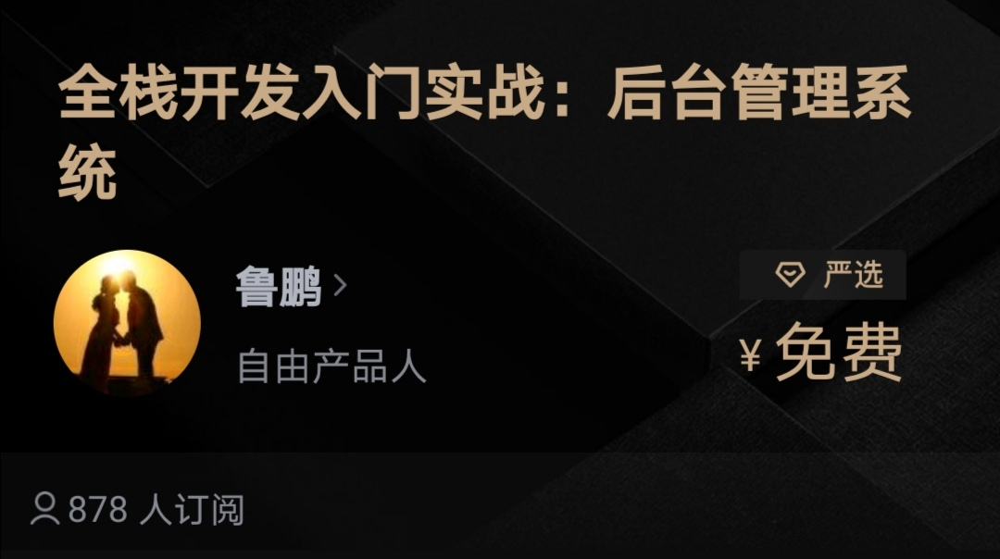
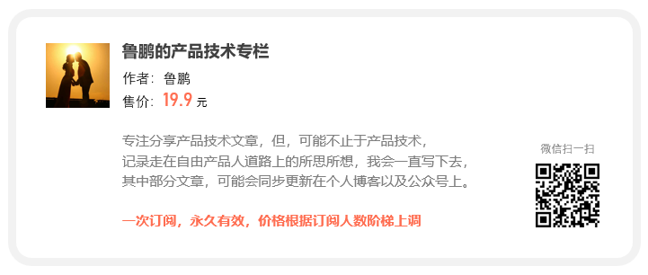

第一次尝试是在 GitChat 平台上，大概写了五六篇文章吧，其中 3 篇是付费的，平均下来每篇大概能获得一百来块钱的收益。

收益分为两个部分：

一部分是非会员用户的订阅，根据文章的定价乘以对应的分成比例，获取相应的收益。

分成比例分为 90% 和 70% 两种，90% 是文章未完成之前产生的订阅，70% 是文章结束之后。

另一部分是平台会员的订阅，会员订阅是不需要另外付费的，作者自然也不能从中按订阅人数来获取收益，这部分的收益，平台每个月底会按照一定的规则，统一对创作者进行分成。

至于具体的分成规则，并不清楚，但是，从我的收益上来看，平台的分成占总收入的很大比例。

因为对于不知名的作者来说，自身很难带来流量，大多数都是依靠平台的流量，也就是平台会员的订阅。

这种模式对于不知名的创作者来说，还是很友好的，总归是能够获得一些收益。

但是，我认为，这种方式是很不明智的选择。

### 不明智的原因

为什么说是不明智的选择？当然了，前提要看你的长期规划，到底是什么?

如果你的长期规划，就是上班之余，写写文章，挣点零花钱，这就已经很满足了，那么这种方式，就比较适合你。

但是，我的长期规划，是想要打造个人品牌，想要更多的人看到我写的东西，认同我的内容，那么，这种方式就不太合适了。

在平台上分享的付费文章，平台方是不允许再进行其他途径的分发，即使是自己的个人博客也是不可以的。

也就是说，你在平台上写的付费内容，版权是属于平台的，内容只能锁死在这个平台上了，然后换来平台的分成。

这感觉就像你在平台方兼职，平台给你发工资，仅此而已。

对于一个不知名，而又想打造个人 IP 的写作者来说，这是非常不明智的。

原本自身就无法带来足够的流量，唯有写更多的优质内容，并且让更多的人看到，才能换来流量以及知名度。

而现在，你还把产出的内容，以付费的形式，放在某一个平台上，更无法让更多的人看到，更加无法获得流量，于是，便形成了恶性循环。

### 尝试免费

我认为问题在「付费=受众小」上，于是，我放弃了短期利益的诱惑，开始做一些**免费**的尝试。

例如，我在平台上发布了一篇免费的文章，获得了 800+ 的订阅，虽然我没有任何的收益，但是，至少让 800+ 的人看到了我写的这篇文章，由于订阅量上来了，而且文章质量还不错，这篇文章获得了官方的「严选」标记。

我觉得，这样的方式，比「只有 100+ 人看到，而我获得 100+ 的收益」，意义要大得多了。

即便我没有获得直接财富收益，但是还是有一些附加价值的。例如，在没有刻意推广的情况下，还给我的公众号，带来了一些新的读者。

但是，我发现了另外一个问题。

### 免费的困境

免费的方式，固然不错，带来最好用户体验的同时，还能给自己带来一些流量。

但是，很快就发现，**用户体验虽然好，但用户价值很低**。

如果把我这篇免费的文章当做一个产品的话，衡量它是否成功的指标，并不应该是 800+ 的订阅数，而应该是实际的阅读数。

因为从用户价值出发，读了才算是有意义嘛。

平台并没有提供「阅读数」这个指标给作者，但是我能感觉到，阅读数应该非常的不理想，或许正是因为数据太难看，所以，平台方才不愿意公开这个数据吧。

虽然没有直接的阅读数指标，但是从一些侧面指标，也能反映一些问题，例如点赞数，评论数等。

这篇文章在发布一周之后，只有 3 个人给我点赞，0 评论。对比之前 100+ 订阅的收费文章，它的评论数以及点赞数，就远远高于这篇 800+ 订阅数的免费文章。

这说明什么？

虽然没有直接的证据，但至少反映了一个问题，800+ 的订阅量中，只有极少数的一部分人，打开了这篇文章，如果再深入到学习这个层面，可能更是寥寥无几了。

我猜测，这主要的原因就是：**文章不要钱的**。

### 脆弱的关系

都能想像到这个场景，用户看到有免费的文章，心想：反正不要钱，不要白不要。顺手就订阅了，等文章发布了，也许都不记得当时订阅过。

从商业的角度来说，用户订阅文章，这个过程，其实就是一笔交易，用户付出成本，换取相应的价值。而成本越低，价值就越低，因为便宜无好货嘛。

这也能够理解，从商业的角度来说，这就是一笔价值交换，付出成本，才能获得对应的价值。

从产品的角度来说，这个产品（写免费文章这件事）无疑是失败的，一，没能给用户带来价值（因为压根没看）；二，无商业模式，不可持续（没人看，我自然没有写下去的动力）。

这样就形成了另外一个恶性循环，没流量（精神奖励），没收益（物质奖励），自然没动力写下去；不产出内容，就更没有奖励。

### 破解之道
当然，这并非无解，你看行业里依旧有那么多知识付费者，活得挺好的例子，那么他们是怎么做的呢？

首先我们要排除一类「暴力破解」的人，他们有强大的意志力，或是已然财富自由，不为生活所迫，即使没有任何的奖励，依然能把事情做下去。

这类人，不管做什么都能成功，不在我们的考虑范围。而正常人，该如何做呢？

一步一步分析，没流量没收益怎么破？一方面，自然要持续提供免费的优质内容，这是个长期过程；另一方面，同时要准备更有价值的付费内容，打通收益渠道。

也就是我们常见的，**免费+订阅**的模式。

大多数知识付费者，都是通过这种方式，例如，通过免费的博客或是公众账号，获得流量以及用户，然后通过提供更有价值的内容，进行订阅收费。

知识星球这类社群工具，就是为了帮助知识付费者，解决订阅问题，而诞生的。

订阅的这种模式，并不是知识付费领域创造的概念，据我了解，早在 2016 年的时候，苹果 App Store 就推出了软件订阅收费模式。

到如今，绝大多数软件行业，都采用了这种商业模式：**免费下载，高级功能订阅收费**。

免费带来流量，订阅带来增值和收益，使产品得以长期发展。

你可能会说，公众账号的主要收入应该是广告呀，根本不是付费订阅，嗯没错，只是我并不认为，公众账号属于知识付费领域，它应该属于媒体领域。

### 第二次尝试

基于这种思路，我开始做第二次知识付费的尝试，免费是基础，付费是增值。

提供免费优质内容的同时，打开订阅渠道，提供增值服务。

所以，我开通了小专栏。

这个专栏跟 GitChat 不同之处，就是内容的版权始终属于创作者，而非平台方。

说得直白点，之前的模式，是给平台打工，而这次，是给自己打工，平台只是服务提供商而已（平台会有抽成）。

这种方式，前期的收益自然是没有平台分成多，但长远来看，价值是不可限量的。

目前为止，专栏里的内容都能在个人博客或者公众号中找到，也就是说，不订阅同样能看到几乎所有内容。

前期我会一直免费公开所有内容，毕竟刚刚开始，也没啥知名度，写得也不够好，收费有点不合适。

而不直接设置为免费的，是不想再次陷入「免费的困境」。

专栏里的文章，都是从博客中挑选出来，关于产品技术相关主题的文章。

截止目前，专栏里的内容，都在个人博客或公众号中公开发布过，所以我也几乎没有做什么宣传。

即便如此，依然有读者愿意付费订阅我的专栏，我想他们并非是因为内容，更多是为了给我支持，对此我非常感激，是他们给了我写下去的动力。

就好像公众号的赞赏机制，所以，我决定，凡是在公众号给过我赞赏的读者（不限金额），都可以找我要一份专栏赠礼，免费加入我的专栏，这个专栏是永久有效的。

同时，我希望你们能够加上我的微信，即便以后平台不在了，我依然会提供相应的知识服务。

**再次强调：这里谈的是知识付费领域，希望我的经历能给你带来帮助，而不是为了推广我的公众号，走向自媒体。**

完。

