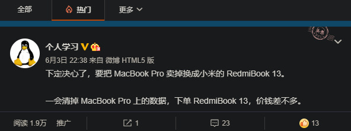

最近买了一台 Windows 笔记本电脑，说到 Windows 笔记本电脑，上一次购买还是在六七年前，那会还在上学呢。

快要毕业的时候，加入苹果的阵营，最开始比较穷，买了一台 Mac mini 作为入门，再后来，又买了一台 MacBook Pro，从此在我的生活里，就与 Windows 渐行渐远了。

<!-- more -->

前不久，又买了一台 iMac，想着未来大概率是不会再去买一台 Windows 电脑了。

谁曾想，没过多长时间，就啪啪打脸。

### 为什么需要一台 Windows 电脑

在前两年或是更早，Windows 电脑对于每一个家庭或是公司来说，几乎是必备的，即便是全员使用 Mac 办公的公司，只要涉及到一些政务或是银行等业务，它们会告诉你 Windows 是不可或缺的，有的甚至还要求使用 IE6，想想也是头疼。

好在这些年，随着移动互联网的发展，很多业务不再强依赖 PC 端，转到移动端后，那些老古董网站，也几乎都下线了。新开发的网站，大概率不会要求兼容 IE6-8 了。

对于不使用 Windows 的人或公司来说，真的是一种解放。

对于我来说，这两年，在工作之外，也几乎用不到 Windows 了。当然，这里还是要强调一下，并不是说 Windows 有什么不好，也没有什么偏见，只是对于一个用户体验至上的产品经理来说，就目前而言，Mac 依旧是最好的选择。

然而尴尬的是，这些年我所工作过的公司，都是以 Windows 为主的。其实，使用 Windows 办公，还是使用 Mac 办公，并不会有太大的区别，仅仅只是习惯不同而已。

那么问题是什么呢？

问题是两者之间的协作，在 Windows 上编辑过的 Office 文档，周末在家，想使用 Mac  继续编辑，那体验真的是酸爽。

每次着急不行的时候，都不得不打开媳妇那台已经 8 年多的华硕笔记本，先救救急。

每每这个时候，总是被媳妇嘲笑，你看，你的 Mac 还不是不行。

其实不是 Mac 不行，是我不行，这么多年了，也没能找到一个不用 Office 办公的公司。

所以，直到目前为止，Windows 环境对于我来说，总是绕不过去的一道坎。

### 买一台 Windows 电脑的导火索

在 Mac 上编辑 Office，虽然难用了点，但每次都还能凑合。如果不是对格式要求特别严格的报告，基本上，将就一下就过去了。

只是将就得多了，心中难免有些烦躁，特别是，每次需要将就的时候，都是在周末处理领导临时安排的任务，烦躁的心情更是雪上加霜。

又是在一个周末，依旧是一个调整项目方案报告的电话，这次是一个上百页的 word 文档，有些章节需要删减和调整结构。

我居然发现，Mac 上的 word 软件，竟然不支持直接在左侧目录视图下，对章节进行快捷删减以及调整顺序。

当时的心态真的是...，什么「垃圾 Mac」「垃圾 Office」的情绪直接就上头了。

后来想想，其实是自己的问题，非要拿心中所谓的完美主义，去衡量其他事务，最终受伤的往往是自己。

每一个工具或是产品，都有它的优点和缺点，你非要拿它去做它不擅长的事情，这不是自讨苦吃嘛。

就像这里，你非要在 Mac 上编辑 Office，还要求人家达到在 Windows 上的体验以及兼容性，想想也是不现实的事呀。

想通之后，我就计划购入一台 Windows 电脑。

### 为什么要卖掉 MacBook Pro

虽然我是数码爱好者，但是对电子设备，还是比较克制的。主要原因当然是穷，要是能够达到「数码自由」，还克制个啥呀。

除了穷，还有一个主要原因，用不过来。设备多了，对我自己来说，是一种使用负担，闲置的话，又过意不去。

所以，我买的每一样电子设备，都有其具体的使用场景。譬如，电脑最多两台，一台台式机，一台笔记本。

台式机满足在家里的需求，性能要好，屏幕要大，刚刚把 Mac mini 换成了 iMac，满足了这样的场景需求。

笔记本满足移动需求，既然要考虑买 Windows 笔记本，那么，这台 MacBook Pro 只能是卖掉了。

查了下，我的 MacBook Pro，如今还能回收将近五千块钱，还是比较不错的，这个价钱足以换一台主流配置的 Windows 笔记本了。

一想到要卖掉它，还是有一些遗憾的。主要是，还没有发挥它的价值，它就已经老去。使用两年多，做过不少开发项目，唯独没有做 iOS 的开发，现在再用它来做 iOS 的开发，略显吃力，因为当时下单的时候，一念之差，没有选择更好的配置。

基于种种考虑，选择现在将它回收，或许是最好的选择。

### 选 Windows 笔记本的纠结

目的需求都想清楚了，接下来就是买 Windows 笔记本了。

一开始，心里就有了想要买的牌子，那就是小米。

说来也奇怪，根据过往买电子产品的经验，凡是有电子产品需求，第一个总是想到小米，然而比对一番之后，最终都没有买小米的，安卓手机便是如此，难不成笔记本也这样？

前段时间正好京东 618，看到小米在疯狂推广新款的 RedmiBook 14，差点就下单了其高配版本，十代 i7，8G 内存，512G 固态，独显 MX250，这样的配置才 4699，实在让人心动。

后来想了想，毕竟是计划要用 8 年的电子产品（未来 8 年，可能不会再买第二台 Windows 笔记本了），还是再考虑考虑吧。

第二天又对比了小米的几个型号，中间改了主意，改成了 RedmiBook 13 寸全面屏的版本，同样的配置，贵了 500 块，5199。

贵有贵的道理，笔记本不能光看配置，设计也很重要，从一堆参数介绍中，找到了不被一般人重视的参数（尺寸，厚度）的差别，从这里，我看到了这 500 块钱的价值，又到了准备下单的时候，发现这款机器竟然一点折扣也没有，其他电脑都是各种折扣，各种送配件，人性的弱点让我又有些犹豫了。

反正也不着急，再看看呗，期间跳出了小米的范围，看了华为的，看了联想的，但是，都没能 Get 到我的点。

突然，我想到微软不也出了笔记本嘛，好久不关注，差点就忘了，打开微软的官网，看到了 Surface Laptop 3 这款，还没看配置价格，第一眼外观还可以，另外微软出品，软硬件结合的产品体验，似乎一下就 Get 到我的点了。

我对电子设备的要求，并不是单纯的性能参数那么简单，诸如，尺寸、重量、外观、系统，以及使用体验，都会有均衡的考虑。其中，体验是最为重要的。

### 最终选择 RedmiBook 的原因

理想和现实，总是有很大的差距，那么就只能在现实的范围内，选择最接近理想的那个。

是的，没错，微软笔记本的价格让我望而却步了。

由于这款笔记本不是高频使用，在公司以公司电脑为主，在家依然以 iMac 为主。对性能的要求，也不是很高，所以，我对这个笔记本的预算定位在 5000 块钱左右，并且还要满足以下的「变态需求」：（重要性从高到低排序）

1. 尺寸轻薄，15 寸以上基本不考虑了，；
2. 颜值要高，全面屏为首选，可以牺牲摄像头（不能因为一个几乎不用的组件，影响了每次使用时候的视觉感受）；
3. 必须是 Intel i7 最新一代的处理器，因为这个关系到能使用多少年；
4. 最好自带正版 Windows + Office，因为懒得折腾了；
5. 内存和显卡主流就行，有没有独立显卡，并不是很重要，我对比了一下，这个价位基本上都是 8G 内存 + MX250 显卡；
6. 以上同等条件，价钱选最低，因为我对笔记本的品牌没有特殊癖好

最后，我发现只有 RedmiBook 13 高配版本，基本符合我的需求。

> 如果发现有其他的型号符合我的以上需求，欢迎来啪啪打脸。另外，我的需求和感受，全是主观意见，仅作参考。

### 后续

买了笔记本之后，我随手发了一条微博，没想到，竟然成为了我最热门的微博。

通过别人的评论，结合我的实际使用，下面来谈一谈这款笔记本的缺点：

1. 电源充电器居然是圆孔插头，外带一大坨变压器。说实话，这一点，直接就拉低了这款笔记本的整体品位，真的很「红米」。
2. 没有 USB-C 口，只有两个 USB 3.1 和 一个 HDMI，外加一个耳机口。这个倒没有多大的影响。
3. 屏幕素质不太好。这个是我的实际使用感受，长时间使用，眼睛会比较累，总感觉色彩和分辨率怪怪的，或许不是这款笔记本的问题，而是我的参照标准是 MacBook Pro 的原因，从 MacBook Pro 切换到 RedmiBook，有明显的落差，也是能够理解的。 

除了以上，其他就是一些软件使用体验方面的了，这个就没什么好说的了，因为软件系统可以自己控制。

例如，小米的笔记本会自带几款自己的软件，在宣传中，竟然还被当作亮点，也是醉了。由于我没有小米的手机或是手环，所以，直接全部卸载了。

完。