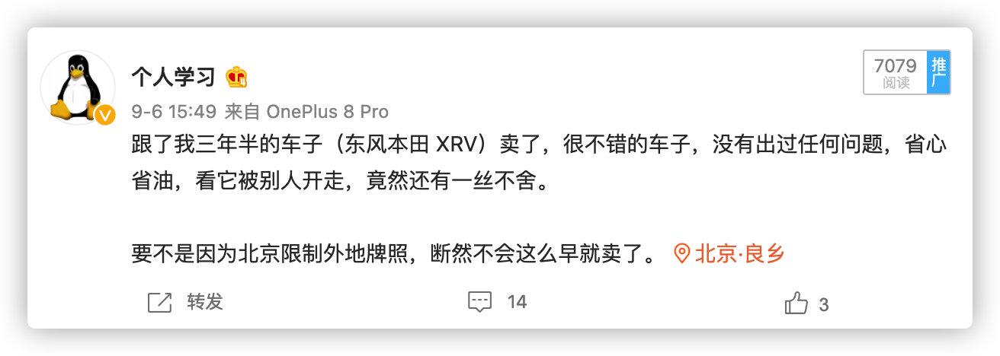

今年 2 月份排到了北京的新能源指标，有效期只有 1 年，意味着农历新年前，我如论如何都要换车了。
<!-- more -->
在上个月的时候，已经换上了新能源汽车，把之前的本田 XRV 卖了，因为不舍，还发了一条微博，纪念一下。

卖了本田 XRV 的当天，我就把新车开回来了，这次买车的经历，远没有第一次买车时的激动，人生的第一次还是弥足珍贵的。

这次提车虽然没啥感觉，但是，选车的过程，也还是让我纠结了好长时间，在这里记录一下。

### 硬性需求

不管干点什么，先谈一谈需求，产品经理的职业病。

汽车是一笔不小的「负债」，而越是负债，却越能勾起人们的消费欲望，消费这类产品，总能让人们获得即时满足感，并从中获得愉悦。

可是，这可不是普通的数码产品，即便我有再强的消费欲望，也会被成本限制因素一下子拉回现实。

除了预算问题之外，还有一项硬性指标，那就是要符合北京市新能源上牌政策。所以，这次买车有两项硬性限制条件，那就是：

1. 预算：25 万以内，基本排除了 Tesla，蔚来，理想等车子
2. 车型：纯电动，北京新能源牌照的限制，排除所有混动车型

这么一列，可选范围直接缩小一半，所以，在你纠结的时候，可以先列一下硬性的限制条件，避免自己在选择的过程中，跑偏方向。比如我还看了一段时间 Tesla 了，后来摸了摸自己的钱包，还是算了吧。

### 需求分类
恰好看车这段时间，老爸在京，连续两三个周末，我两就一块出去看车子，试驾了比亚迪汉、小鹏 P7，实际体验了比亚迪秦/秦 Pro、荣威 Ei5、荣威 ER6。

除了这些，可选的车子还有很多，例如北汽的 EU EC 系列，比亚迪的 e 系列等等。

这么看还是容易挑花眼，需要将需求进一步分类。我大致浏览了一下这些车子的价格，然后根据车子的性质、用途以及面向的用户群体，分为以下三类：

#### 10 万以内城市代步

空间小，续航低，非刚需，主要面向那种家里已经有一台车子，或者为了占车牌的用户。

代表：比亚迪 e1 以及五菱宏光 MINI EV（这可是月销量超越过 Tesla 的新能源车型），可见这类需求占比并不小。

#### 10-20 万传统主流

空间大，续航高，刚需，主要面向真正需要一台车的用户，作为出行或者通勤的需要。

这类代表就比较多了，大多数车企几乎都瞄准了这个价位段，上面提到的比亚迪「秦」系列，北汽的几乎所有车型，以及荣威 Ei5，ER6，都在这个价位上。

**新能源汽车首先要是一台车子，它要能够满足便捷出行的刚需。刚需用车，我认为空间和续航是主要考量的因素。**

而其他方面，这类车型就比较中规中矩（传统）了，外观传统、配置传统、功能传统。从驾驶体验或是内饰布局上，跟燃油车相比，其实没有太大的区别，唯一的区别可能就是燃油车用油，它用电。

所以，大家的宣传亮点基本上就是续航了，而续航的高低，基本上也跟价格挂钩。10-15 万，续航差不多在 400-500 KM，15万-20万，差不多就能到 500KM + 了。

#### 20 万以上高端智能

虽然写成「高端智能」，其实并非真的「高端智能」，只是相比传统主流的车型，要稍微显得高端一些，毕竟上了 20 万。

高端的体现，要么续航更高，要么造型更酷，要么更加智能。例如：小鹏汽车、比亚迪汉的续航都能达到 600 KM 以上，而且外观造型相比传统车型，的确要好看多了。同时，它们也多了很多的配置（传感器、摄像头等），实现一些「高端」功能。

**新能源汽车不仅仅只是一台车子，它还要是一台互联网终端，能够与手机互动，能够自动驾驶，能够让你体验以前只能在电影里看到的智能场景。**

在试驾完小鹏的 P7 之后，我几乎都要直接交定金了。它的定位，更符合我对于一台互联网汽车的期待，不过跟老爸商量之后，最终还是放弃了。

### 最终的选择

老爸更加倾向于传统主流的汽车，他的想法是车子就是出行工具，空间够载一家人出行，续航能达到四五百公里就行了。

他觉得所谓的智能不智能，座椅加热不加热，都没啥实际作用。

而我却觉得，花十几万又买一个传统的车子，心有不甘。如果只是必须要占上新能源车牌，何必要花十几万呢？买个几万块钱的代步车，占上车牌不就行了。

可是，几万块钱的代步车，空间实在太小了，周末想带孩子出去玩一下，连婴儿车都装不下去，实在有点尴尬。

最终，考虑当前的实际需求（空间要够），以及顾及我的不甘心（成本折中），选择了 **Golf 纯电**，全下来刚好十万。放弃了所谓的智能，还有续航。

选择这款车，主要原因有三点：

1，目前开车需求并不是很高，平均下来，每天 10 公里都不到，主要用途就是遛娃。要是搁在以前通勤使用，可能又是不一样的选择了。

2，目前新能源汽车才刚刚起步，2020 年对于新能源汽车来说，就像手机时代的 iPhone 4 发布的那年，当还远远不够成熟，要不是新能源的车牌有效期的问题，我觉得可以再等上两年。

3，上述的那些车子，基本上都看过了，整体来说，对小鹏 P7 的满意度是最高的，试驾之后差点就选它了，冷静下来之后，分析了以上两点，又断然放弃了。省下来的这十几万，做点投资，买点资产，远比买个使用频率不怎么高的负债要强得多了。

最后，Golf 纯电只是个过渡，基本满足现有用车需求，同时把新能源的牌子占上，等时机成熟之后，一定要拥有一台真正意义上的电动车。