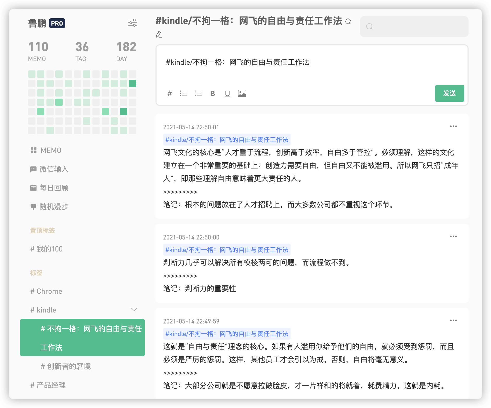
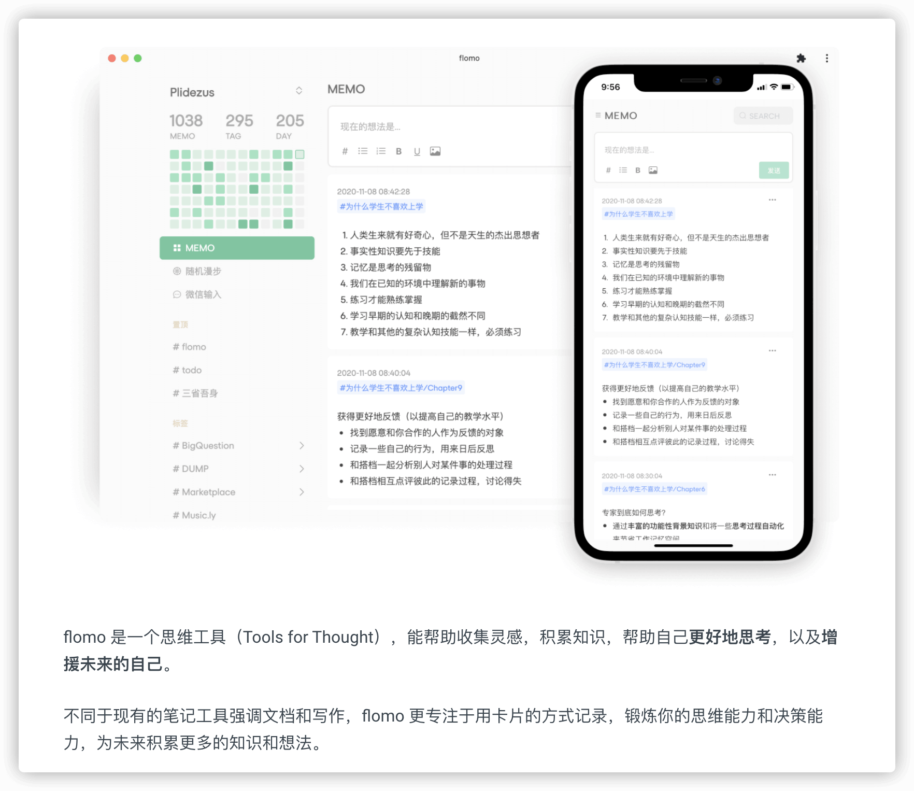
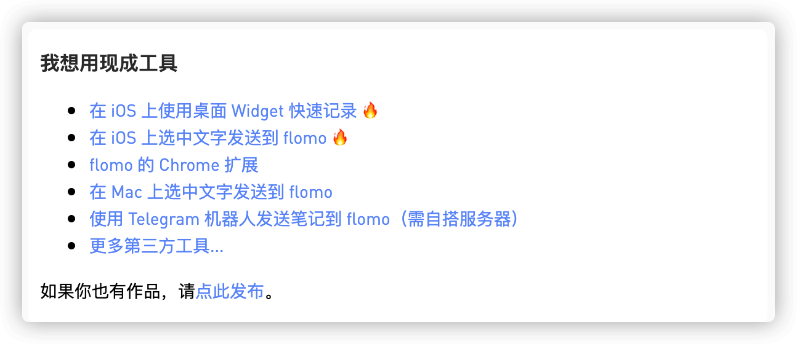

断断续续花了一周的时间，终于把这个小工具做完了，做成了自己满意的样子。

<!-- more -->

这个小工具是为了快速将 Kindle 读书笔记，一键导入 Flomo 中。

然后就可以在各个平台上通过 Flomo，随时随地查看 Kindle 读书笔记了。

### Kindle 读书笔记整理
这是我一直以来的一个需求，只是使用频率并不高，所以很长一段时间直接忽略了它。

想查看一本书标注的笔记，我通常都是直接去 Kindle 阅读软件上查看，虽然麻烦点，倒也能够接受。

读书笔记这块的使用体验，是 Kindle 阅读这个生态环境下，少有的，做得很差的地方。

那么只要有用户需求，就会有对应的产品服务，[clippings.io](https://www.clippings.io/) 就是在这个需求下诞生的产品，它算是做得比较大的一个平台软件了，就为了解决 Kindle 笔记整理的这么一件事情。

这个平台要发挥它的作用，完全依赖于一个 `txt` 文件，一个需要用户把 Kindle 用数据线连接到电脑里，才能获取到的数据文件。

我觉得麻烦，试用了一下，就不想用了。

除了 clippings.io，还有几个 Kindle 笔记整理的软件，例如：Knotes，Klib。

他们除了提供 Kindle 笔记的导入，还支持多个平台读书笔记的导入功能，例如：微信读书、多看读书等。

但是，体验依旧不是很好，主要原因是笔记的使用问题上，导出笔记自然是希望能够随时随地用到它，例如：在写文章的时候，突然想到书中的某个句子，想要翻一翻。

**可惜他们都只是提供了整理方式，而没有考虑使用笔记的场景。**

而且，针对 Kindle 平台的笔记，大家似乎都必须依赖那个 `txt` 文件，这就让我很蛋疼，导一次笔记，找一回数据线。

### flomo 整理笔记新方式

Flomo 是个啥？我给的定义，它就是一个记录工具，跨平台同步以及简洁的特性，让我一下子就爱上了它。

想到什么，记一下；看到什么精彩句子，摘抄一下；想说什么，简单写一下。

官方定义它是一个思维工具，帮助收集灵感，积累知识，帮助更好地思考，以及增援未来的自己。

嗯，这应该是它的愿景，希望成为人们的思维工具。

我没想考虑那么远，首先用好这个记录工具再说，既然是记录，笔记理所当然属于它的职责范畴之内。

当然，记录这个事情，Flomo 的创始人显然比别人想得更远，想得更深刻。

记录的输入端一定要是方便简单，且毫无压力的，需要满足各种场景下的便捷输入。

涉及到输入场景，那多了去了。微信里看到一个句子，想立马保存下来；读书的时候，想随时记录思考；微博等各种社交 App 里的动态等等。

如果这所有的输入场景，都由官方来做，那就太费劲了。

Flomo 没有这么做，而是用了一种非常聪明的方式。那就是：**提供记录的 API，而且只有记录的 API**，因为它要解决的问题只是各种记录场景下的输入。

输入的权限放开了，自然会有各种输入插件出来，满足各种场景下的记录需求。

而 Flomo 可以把更多的精力，放在「帮助人们思考」这件事，在这一点上，真的很赞。

至于怎么能帮助人们思考？大家可以试用一下，我就不赘述了。

### Kindle to flomo 插件
做这个之前，我先在群里问了下少楠（Flomo 创始人），是否有 Kindle 笔记导入 Flomo 的插件？

整理 Kindle 笔记是我长久以来的需求，之前一直没有找到让我比较满意的方案，自从遇到 Flomo，突然眼前一亮，这个搭配应该不错。

Flomo 已经有了很多插件，各种场景下的记录都有了插件的支持，浏览器插件 Flomo Plus 还支持微信读书、微博、即刻等平台动态的导入。

可是，竟然没有 Kindle 笔记导入的插件，令我有些失望，也有可能有人做了给自己用，没有公开。

既然没有，那就自己来吧，好不容易找到了 Kindle 笔记整理的最佳搭配，万事具备，只欠东风。这个长久以来的需求就差临门一脚了，这一脚就自己来吧。

要做这个，首先要了解 Kindle 笔记的导出，于是，我先去把 Kindle 各种途径下的笔记文件的导出功能都试了一遍，总结了这篇文章[《详谈 Kindle 读书笔记的导出》](https://mp.weixin.qq.com/s?__biz=MjM5MDQ4NjUwMg==&mid=2649198191&idx=1&sn=95c506dde4a079d2840a91b12ca358a8&chksm=be5734e68920bdf04af5ad5f31d8c40acea17e723b1b0eeaa2d3d47d009a0adc5abca44bc953&token=1351484622&lang=zh_CN#rd)。

发现要整理 Kindle 笔记似乎没有更好的办法，只能是解析导出的文件。

最后选了两种格式的笔记文件：Kindle 阅读器导出的 CSV 文件以及 Kindle 阅读软件导出的 HTML 文件。

我没有选择被普遍使用的 `My Clippings.txt` 文件，主要是因为不想找数据线了。

确定了笔记文件，接下来就是对这两种文件进行解析，最后调用 Flomo 记录的 API，就可以一键将 Kindle 读书笔记导入到 Flomo 里了。

当天下班回家，等娃儿睡觉之后，我打开了没用过几回的 Python IDE，新建了一个叫 kindle2flomo 的项目。

数据解析自然要选择 Python 来做，即便是我这样的新手，不到两个小时也搞定了插件的编写，当晚就顺手导入了上个月看完一本书的笔记，终于满足了自己多年的需求，还是蛮有成就感的。

这个故事原本这样就结束了。

### 把插件做成一个工具产品
做完插件之后，我就在群里说了一声。

没想到，少楠联系到我，问我是否愿意公开这个插件。

我自然是没啥意见，只是看了看这加起来不到 50 行的代码，即便公开了，应该也不会有人想用吧。

既然想要公开，自然希望真的能够帮助到别人，草率的把几行代码扔出去，显然不是我一个产品经理干得出来的事。

作为一个产品经理，本能就把它当作一个产品来对待了，最基本的用户体验得有吧，总不能让人装上 Python 的环境，然后运行代码才能使用吧。

决定要做的话，那就尽自己最大的努力去做吧。一句「我完善一下再公开」，没想到竟然花了我一周的业余时间。（好吧，我承认我是技术菜鸟）

自己能用，跟让别人也能用，之间差得不是一星半点，需要做的额外工作显然超出了我的预估。

别人要能用上，首先我需要做一个界面，涉及到界面，起码需要有个简单的设计（布局也算），界面上提供哪些功能，需要有个简单的需求分析。其次，我还需要把插件包装成后台服务，涉及到后台服务，需要有基本的防错校验，还需要部署到线上环境等等。

很多开发内容，我也是第一次接触，遇到问题，只能通过搜索，一个一个的解决问题，不断在产品功能和技术实现之间做平衡。

最终，才有了目前这个版本，虽然还有一些预期的功能并未完成，但目前基本达到了可以公开发布的标准了，至少在我看来算是通过了。

如果再迭代新的功能，就远远超出了我原先的需求范围，所以，后面如果没有特殊的原因，我大概率是没有动力再迭代下去的。

### 最后的发布
这个小工具最开始是为了满足自己的需求，然后是应少楠的邀请，想着把它对外发布出去。再者，由于作为产品经理「完美主义」的洁癖，完善了一下，最后就这样了。

目前具备的功能，在界面上一目了然：

1. 支持 CSV 和 HTML 两种格式的 Kindle 笔记文件
2. 支持在页面上预览笔记，显示笔记条数
3. 支持自定义分隔符，来划分标注和笔记
4. 支持一键批量导入一本书的所有笔记
5. 支持导入的笔记在 Flomo 上顺序查看

想做但还没做的功能：

1. 支持可选择性的导入笔记
2. 支持编辑笔记内容，再选择导入
3. 支持多本书笔记的切换预览以及导入

好了，就这些了。如果这个小工具，恰好也解决了你的需求，那我这一周也值了。

项目代码放到 Github 上了，点击原文链接查看。
[kindle2flomo：Import kindle notes to flomo](https://github.com/pengloo53/kindle2flomo)