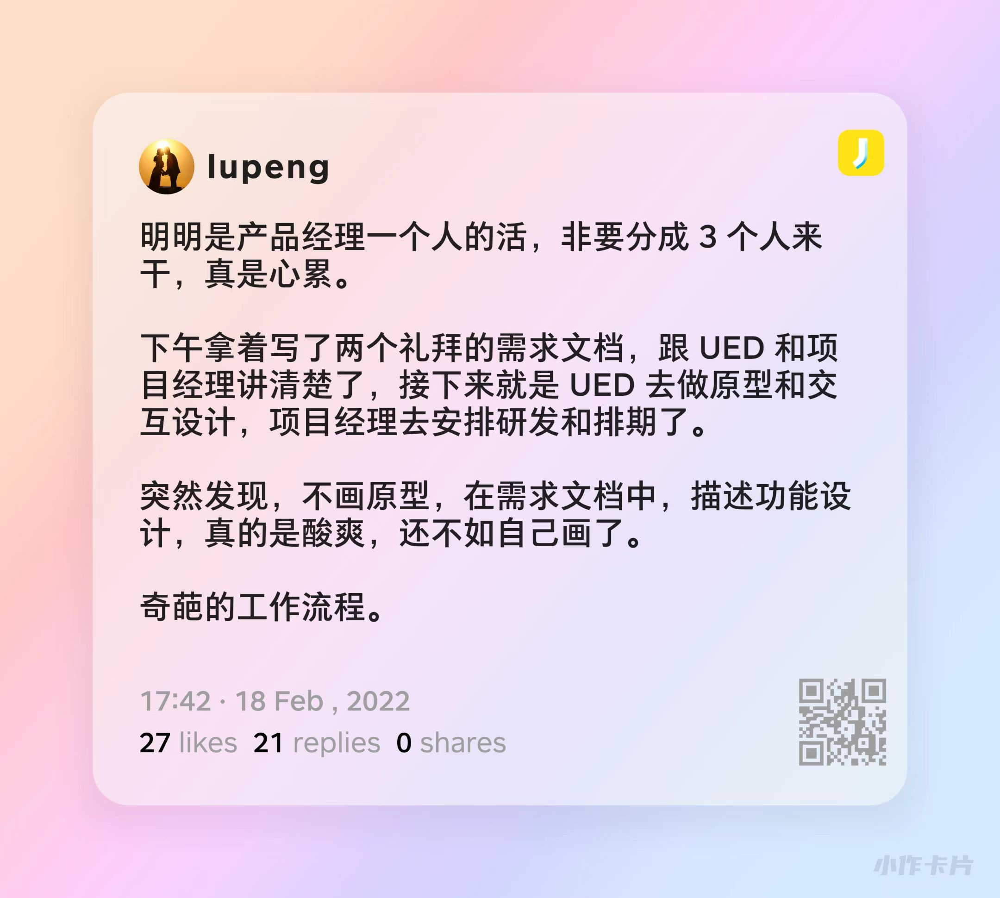

上周似乎没啥亮点，简单聊一下工作（toG 产品）上的一些事情吧。

主要总结两点思考：
1. 卖产品还是卖方案的问题
2. 产品岗位职责细分的问题

<!-- more -->

### 卖产品还是卖解决方案

之前[一篇文章](https://mp.weixin.qq.com/s/btIy_z6qrT1hyk41Z4spYw)聊到过公司组织变革的事，其中一个核心是：由之前单一产品销售到解决方案销售的转变。

为什么要重点强调销售解决方案？

因为产品同质化严重，市场竞争力太大，经常性同友商价格战，卖产品赚不了钱，所以要转卖解决方案。

这里面的逻辑我觉得不应该是这样的，正确的逻辑应该是，在既有市场竞争力的前提下，想要追求更大的利润，基于客户需求场景，形成整体解决方案。区别是，已经有具备核心竞争力的产品，为了追求更大的利润，才去推解决方案。

**推解决方案的前提是，单一产品要足够好。**

如果产品在市场上都没有啥竞争力，于是想到去规避产品的弱点等不利因素，而转去推解决方案，就是明摆着忽悠客户。

推解决方案也是有适用条件的，对于已具备核心竞争力的市场，采用这样的方案，没有任何问题；然而对于新开拓的市场，还不具备核心产品，就采用这样的思路，是行不通的。

另外，对于那些有明确需求的客户，甚至客户对需要哪些产品来满足自己的需求，都非常清楚，在这种场景下，就是典型的卖产品，而不是推解决方案。

推解决方案是针对那些不知道自己想要什么，但是又必须要做点什么的客户。典型的例子就是：政策要求必须要做的，不做不行，但是做了也不知道能产生什么效果的情况，才是推解决方案的最佳场景。

### 产品岗位细分的利弊

记得之前有过抱怨，一个产品经理的岗位，硬要拆分成三个人来做。

评论中大多都是羡慕的眼光，而我却觉得非常困扰，而且干得挺糟心的。

渐渐地，我发现，问题的本质其实不是岗位职责细分不细分的问题，而是能力模型是否匹配的问题。

岗位细分是没有问题的，但是能不能把一个岗位的职责拆成三个部分，分别让三个人来承担相应职责，从而提高 3 倍效率，才是问题的关键。

现实往往是很难做到：

第一，需要通力协作的岗位，在一些职责边界上，原本就很难界定清楚；

第二，即便是岗位职责界定清楚了，找到符合对应岗位职责的人，也就是说找到能力模型和岗位匹配的人员也是很困难的；

第三，即便上面两种情况都满足了，两人之间的协作是否融洽，也是至关重要的因素，思路不在一条线上，每次评审就吵架，这样的职责划分，还不如不分。

团队之间的磨合也许都需要经历这个过程吧，只能这样安慰自己。

只是，这样出来的产品，往往是缺少灵魂的，因为每个功能点都是 3 个人决策出来的结果，这样的决策质量是低下的，出来的产品大概率是平庸的。

不过也并非毫无用处，至少出现重大错误的概率会低很多。

