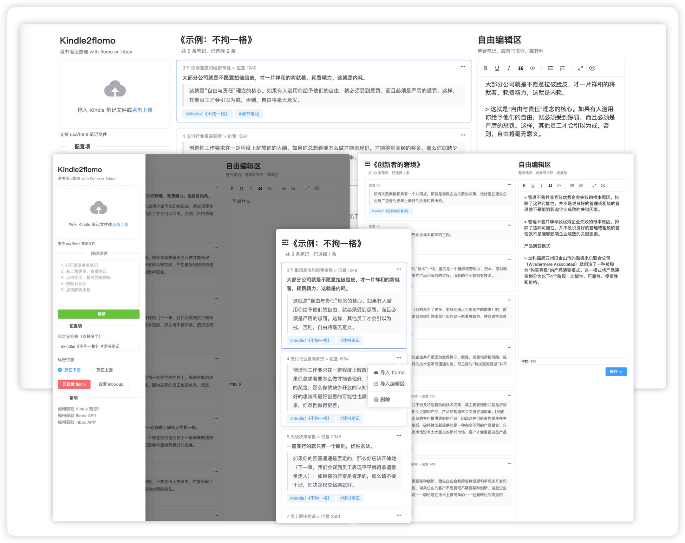
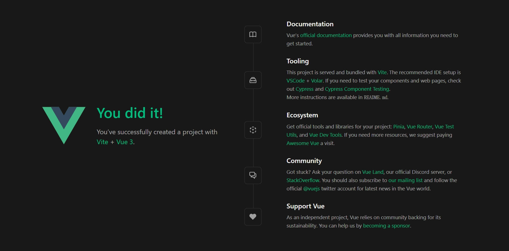

访问地址：[https://90byte.com](https://90byte.com)，注意：没有 `www`

旧版的地址还在：[http://kindle2flomo.90byte.com/index.html](http://kindle2flomo.90byte.com/index.html)，喜欢多列展示的，还可以继续使用。

主要功能：

1. 读书笔记整理，支持 Kindle 以及微信读书笔记
2. 支持笔记导入到 flomo
3. 支持笔记导入到 [Inbox](https://app.gudong.site/inbox/)（一款安卓原生的笔记软件，离线编辑体验极佳）
4. 内置了一个编辑器，方便整合笔记
5. 移动端的适配，将页面添加到桌面，体验也还不错

好了，下面开始讲故事。

### 缘由

在给 side project 调研 UI 框架的那一周，我发现，我需要重学 Vue，其实也不算重学，之前也压根没好好学过。因为我在看 UI 框架官网的快速入门文档的时候，才发现，我连个 UI 框架的入门教程都已经看不懂了。

后来才意识到，这些基于 Vue 的 UI 框架，在编写文档的时候，一般是建立在已经掌握 Vue 的前提下去编写的。而现在 Vue 的知识体系，已经远远超出我当时所了解的那点皮毛了。

回想起来，初次了解 Vue 的时候，还是 2019 年初在一个[开源项目](https://github.com/lyricat/wechat-format)上改过几行代码。再后面，对于 Vue 的学习，基本上就是原地打转，最近一次用到 Vue，便是 [Kindle2flomo](https://github.com/pengloo53/kindle2flomo) 这个项目了，这也都是两年前的事了。

这次重拾 side project，抬头一看，我已经落下这么远了。

### 快速入门

根据快速入门手册，很快把环境搭建好之后，便开始入门学习了。这块内容倒是非常顺利，好在 Node 这些年，变化没多大，之前的一些经验还能用上。

通过命令 `npm run dev`，项目便启动起来了。这个启动页面还是很不错的，比 Vue2 那个好看多了。

好奇看了下 `package.json` 里配置的 `dev` 命令是个啥？ `vite`，vite？一脸懵逼，我不认识它，它也不认识我，先不管了，后面再说吧。

### 看文档

这次直接从 Vue 的第一篇文档开始学习，不得不说，这些年 Vue 的发展确实不错，官方文档的质量都如此之高，除了文字说明，还有互动教程和示例，这么完整配套的学习工具，要是学不会都对不起这个教程，对不起 Vue。

跟之前对 Vue 的认识，最大的差别是 API 风格分为了**选项式**和**组合式**。选项式可以理解为：为了兼容之前版本的书写方式。然而对于我来说，既然无历史包袱，干脆直接就上手组合式了，当自己啥都不会就对了。

差不多花了两天摸鱼的时间，才把基础部分的文档看完，看的时候，基本上都尝试去理解过后，才翻过的。

即便是这样，在后面项目实践的时候，也是一脸尴尬，甚至有些部分，跟之前看文档时所理解的不太一样，这种情况，正常来说，只能依靠自学（review+search+debug）了。

例如，在深层侦听器那里，响应式对象并没有如文档所说，默认就是一个深层侦听器，非要加上 `{ deep: true}` 参数强制转换一下才可以侦听对象。

> 直接给 `watch()` 传入一个响应式对象，会隐式地创建一个深层侦听器——该回调函数在所有嵌套的变更时都会被触发。

不知道是不是父子组件之间传参的影响，官方的示例也没有那么全，不过，问题能够解决，便不再深究，在入门学习这个阶段，也没必要（也没精力）去深究问题的根本了。

### 做项目

看完基础教程之后，便开始直接做项目了，但不是从零开始，而是拿着 kindle2flomo 项目开始，这个项目可以说是当时临时拼凑出来的，就是一个 html 文件承载了所有的功能，改到后面实在是改不动了，因为代码过于臃肿。

正好借助这次的学习，将它重构一遍，直接就在上面的 vue3 demo 上改了，把原项目不要的模块直接注释掉，就开始迁移代码了。

上来便是拆组件，将页面拆成若干个模块，作为 `App.vue` 的子组件。这个过程遇到的问题便是：UI 框架兼容性。

之前用的 Element，这次用的是 `Element Plus`，也就是 Element 的 Vue3 版本，选它也是为了减少一些适配工作，不过，也免不了频繁的查看官方文档。总体来说，页面的迁移还算顺利。

拼完页面之后，也就是完成 `template` 部分之后，便开始写页面逻辑，这块几乎就是重写了，因为 vue3 的组合式 API 书写的方式变化还是挺大的。

其中花时间最多的两块功能是：

1. 解析笔记文件，上传文件的逻辑
2. 导入 memo，异步请求的逻辑

之前项目使用的是 `axios` 这个库来解决上述问题，调用 post 请求接口便可以了。

然而，这次不知道哪里抽风了，看到 Vue 官方示例，使用 Web API `Fetch` 便可以完成异步请求，对于这样简单的场景来说，根本不需要引入第三方库 `axios`，于是，我也想尝试使用原生 Web API 试一下，尽量少引入一些第三方库，总归是好的。

只是，我还是把事情想简单了，过程并没有那么顺利，期间焦虑的上了好几次厕所，一顿 search，好在最后解决了。

虽然多花了一些时间，踩了一些坑，但也是有收获的。

还是那句话：**能解决的问题都不是问题，那些踩过的坑都是经验。**

### 部署上线

重构完核心功能之后，又花了大概相同的时间做了很多优化工作，让我想起下面这句话：

> 做好准备，当你完成任何大型项目的 90% 时，其余无数的细节将需要第二个 90% 来完成。

比如：移动端的适配、样式的优化调整，以及友好的提示等等。

又过了几天时间，完成上述那些七七八八之后，终于可以线上部署了。

好在，这次直接使用的是 Vue 官方的构建工具，也就是上面提到了那个 Vite，简单翻看了下线上部署那篇文档。

对于目前这个项目来说，构建完，当作静态站点部署即可了，于是，运行 `npm run build` 也就是 `vite build` 命令，就完成了构建，然后，将 `dist` 目录拖到服务器上，就可以了。

最后，简单配置下 Nginx，完事。