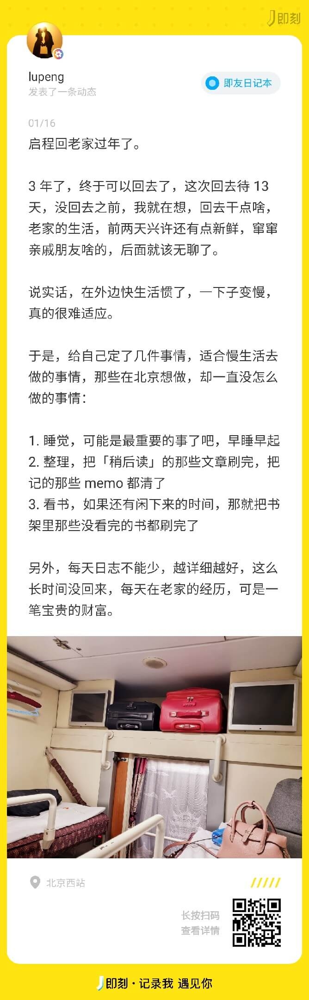
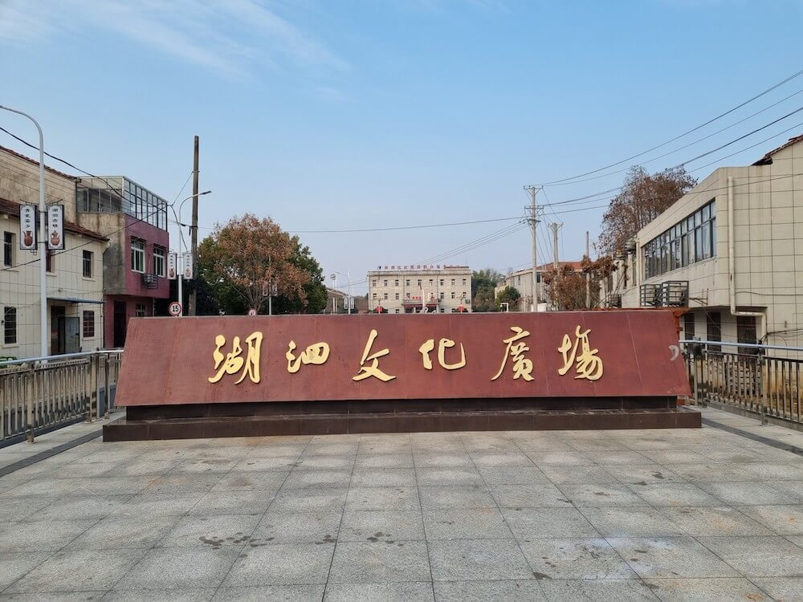
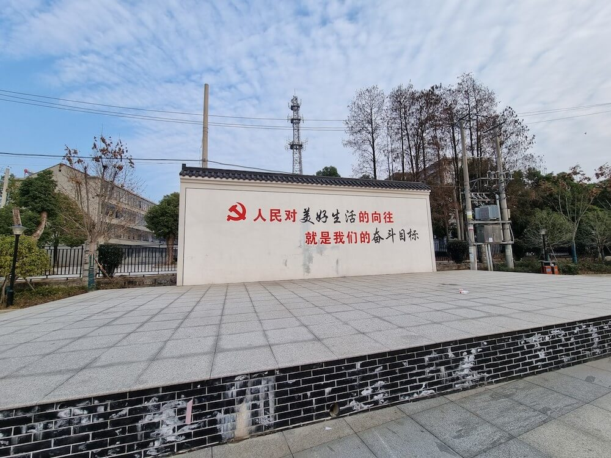
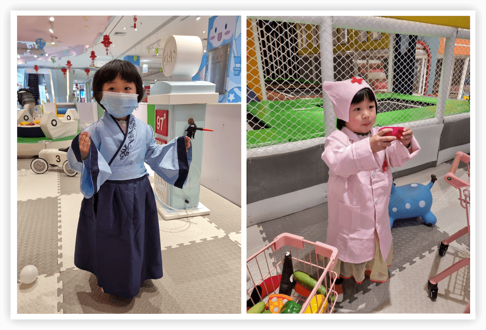
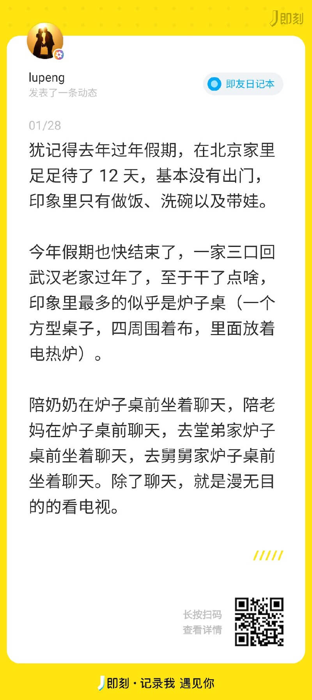
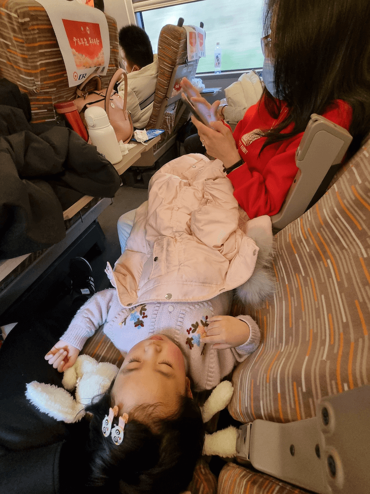

2023 年，别人都在忙着发布上一年的总结，而我直接断更了，真不是一个好的开始。

这篇长文近 4000 字，把从元旦后上班第一天，到春节后上班第一周周末，期间所记录的一些碎片，汇总了一下，就此形成了 2023 年第一篇大杂烩。

### 年前居家办公：忙成狗

2023 年第一周的工作日，我没有去公司，主动居家办公了。

原因有三：

第一，小家伙跟我爸回老家了，在家里，也可以正常办公，工作任务不会落下。

第二，我所在的产品中心就我一个人在北京，也无需跟别人打招呼请假。

第三，疫情防控放开后那两周，大家都感染居家了，而我是无症状，一天也没落下，公司通告，这周过后，再也没有感染居家这一说了，于是，我便趁着这机会名正言顺居家几天，体验体验居家办公的生活。

居家倒是居家了，然而并没有感觉很轻松，反而比上班的时候更忙了。主要原因如下：

1. 这段时间恰逢公司组织架构调整，协助提交各种规划报告
2. 产品上个版本刚刚发布，七八个研发等着我的下个版本需求以及原型，这是我的问题，国庆节前后的那个月摸鱼太狠，欠下的迟早要还
3. 在家里办公，一日三餐需要自己做，做饭需要花一些时间
4. 中午在床上随便一躺，1 个小时就过去了，而在公司基本不睡午觉
5. 在家办公没有周围同事监督，偶尔拿起手机，刷着刷着就忘了时间
6. 在同一个环境下办公，即便下班时间到了，也不想再干 side project 的事，缺少了氛围，居家办公一定要准备两套环境：工作和生活区分开。这一点很重要

当然，居家也是有好处的，例如：不用通勤，睡眠时间多了；日常开销少了，省下了地铁通勤和早饭午饭的消费；吃的也相对健康一些，毕竟是自己做的。

### 回老家过年：盘算着这 13 天假期

公司没有年假，全部统一放到春节（前 3 后 2），总共 12 天假，加上最后一天请假，这次春节总共 13 天。

定的晚上的软卧，上了火车之后，就在想着回老家干点啥，有感而发，写了下面这段话。

我以为我写得已经很「落地」了，而现实更加「残酷」，写的时候，我大概是忘了最大的一个变量：家里有娃。

上面计划列的内容，除了睡觉和几篇日志，就没有其他的了。

### 到达武汉：先来碗热干面

坐夜间的软卧是最舒服最省时的长途交通方式了，一觉醒来便到了武汉。

火车提前了十来分钟，下了车，吃了个早饭，首选热干面，火车站的还是要贵，不过也就 10 快钱，比在北京的 10 块钱热干面，至少味道要好一些。

吃完坐地铁到了离老家最近的一站：青龙山地铁小镇。新开的地铁，这条线都没听过，不过，话说回来，武汉的地铁我也没坐过几回。

下了地铁，就坐上堂弟的车回家了，堂弟开车带着小家伙和我妈一块过来接我跟媳妇。

小家伙看到我们，那叫一个激动，小脸蛋都笑出了花。一路上叽叽喳喳说个不停，抱着我两又亲又啃的，看来是真想我们了。

### 回老家第一件事：送葬

到了老家小镇，还没来得及回家，第一件事就是送葬。

三奶奶（我爷爷的弟弟的媳妇）前两天过世了，我爸一直在他们家里帮忙，我们一到，我爸就给我们头上带上了“孝”，儿女一辈带白颜色的，孙子一辈带红色的，再往下一辈，带黄色的。

我爸连忙给我跟媳妇带上了红色的布条，给小家伙带上了黄颜色的布条，然后拉到马路边，递过来一片纸盒，跪下，面向棺材。

围绕棺材最里面一圈是三奶奶的儿女子孙，我们隔代亲属跪在外面一圈。

过了一会，就起棺上山了，八个人抬着棺材走在前面，后面跟着长长的队伍，我们跟在队伍的后面，往老家山里的方向走去，走一段便停一会，不知道是有啥讲究还是抬棺的人累了要休息会。

走了两段，小家伙便不想跟着去了，要回去，一路上闹哄哄的，鞭炮齐鸣，锣鼓喧天，难怪也不想走了。

我简单劝说了下，勉强又跟着走了一段，到了山入口处，我妈说想回去就可以回去了，朝着棺材低头三鞠躬，就返程回去了。

这才拿上行李，往家里去。

### 到家第一件事：写年终总结

回老家小镇这天，还是工作日。在送葬的路上，领导一个劲的给我打电话，我没敢接，这么吵闹的环境，接了还得一顿解释，干脆就没接了，就当做还在火车上没信号吧。

到家放了行李，第一件事就是给领导回电话，之前已经看到他的消息了，要催缴年终总结。这事是我的问题，一直拖着没有写，已经逾期一天了，被催也是意料之中，原计划昨天晚上在火车上写的，结果上了火车，就把这事给忘了。

听领导的意思，还是挺重视我的，专门打电话过来，是想要让我好好写，别敷衍了事，看样子是想给我一个好的绩效，但如果材料不过关，难免会说不过去。

于是，行李一放好，便把自己关在卧室里了，打开电脑，连上家里的 wifi，翻阅之前的材料，写了大概 2 个小时，中午饭都没顾得上吃，还是老妈端过来给我吃的。

一点半的时候提交了，还提前了半小时交上去了，这才松了口气。此时小家伙已经睡着了，趁着这个时间，又写了几篇日志。

### 小镇的变化：多了个广场

小家伙醒来之后，带她去了广场，准确说，应该是她激动的带我们去了广场，前几天我们没有回来的时候，这个广场是她玩得最多的地方。

一年多没有回来，变化最大的地方就是这个文化广场了，以前连个正经的入口都没有，广场在楼房的后面，这次拆了两栋楼房（我们小镇楼房都是 2-3 层的小栋），改成了广场的入口，这么一改，的确是看着舒服多了。

我妈上班的地方就在广场的后面，所以，小家伙每天跟着她奶奶去办公室玩，都会经过这个广场。

广场除了新建了入口，里面的布局也进行了调整和翻修，现在有亭子，有舞台，还有篮球场，整体感觉还是不错的。

### 年前进趟城：玩儿

老家虽然在武汉，但是地处偏僻，离区（县）中心得有 40+ 公里，坐公交得一个多小时，我们借了表弟的车子，拉着我妈还有媳妇孩子，进城了。

进城的主要任务是来给我买新年衣服的，用老妈工会的优惠券，这么大了，还不忘了啃老，啊哈哈。

花了一千多块钱，买了一件羽绒服以及一条外裤，话说好多年没有买过新衣服了，我向来不讲究穿衣打扮，结婚以前基本上是老妈一手操办，给啥穿啥，结婚以后，基本是媳妇一手操办了，同样是给啥穿啥。

在商场逛了不到一个小时，任务就完成了，我还是比较好伺候的，穿着合适，媳妇看着还行，就定下了。

小家伙到了商场，看到儿童游乐场，便挪不动脚了，的确也是好长时间没有玩过这个项目了，面积不大，愣是玩了 3 个多小时，这 35 块钱的票钱算是值当了。比起北京还是要便宜一些，在北京类似的游乐场至少也是两倍价钱起。

小家伙玩耍的地方，便是我们在外的根据地，午饭直接在商场楼下买了点快餐，到游乐场外围吃的，边吃边看着小家伙，今天孩子不多，外边都是给家长预留的位置，吃午饭还是很方便的。特殊时期，至少还是要比楼下拥挤的餐厅要放心一些。

一直玩到了将近 4 点才返程，小家伙上车便是睡觉，一路睡到了家，近一个小时，就当是午觉了。

看样子，是玩得尽兴了。

### 给老妈换手机：习惯最重要

春节在家里，帮老妈把手机换上了，新手机是我寄回来的坚果 R2，寄回来差不多都半年了，一直都没有换上，老妈说不会弄，旧的还能用，就用着。

旧手机是 OPPO 的一个型号，用了 4 年多，当时买的虽然是新的，但也不是旗舰，与坚果 R2 相比还是要差上许多。

对于一个不在乎微信聊天记录的人来说，换手机就要简单的多了，导一下通讯录就可以了，装上常用的几个 App 就完事了。

不过，我还是尽可能的为其保留了一些历史记录，为了让她能够更快的适应。比如：

- 通话记录
- 短信
- 微信聊天记录（纯文字）
- 一些系统设置：例如，壁纸、铃声、虚拟按键等

整个换机过程，数据倒不是主要问题，而是一些系统设置。

**一个人的使用习惯，是替换成本最高的部分。**

### 春节在家里的日子：到处晃荡

假期的其他时间，基本上就是吃饭、睡觉、遛娃，除了坐车出去的几天，在小镇里，每天的生活基本一致。

不过与去年在北京家里相比，似乎要轻松愉悦一些，少了许多家务，多了一些闲聊闲逛。

### 从老家返程：花钱少受罪

初八的火车返程，一路上倒也顺利，并不是很累，中午饭后从老家出发，6 个小时高铁，到北京家里，已经是 9 点多了。

这么长时间的路途，怎么可能不累？不过这已经是最优解了。

今年年后返程的车票，着实是不好买，还剩余有票的车次，基本上都是时间点不好的，要么是凌晨上车的，要么是凌晨下车的。

带着孩子，这类车次基本上就不考虑了，要想少受罪，那就只能是多花钱了。

1. 买不到武汉到北京的，那就路程买长点，于是，抢到了从湖南长沙出发的车票，路过武汉，每张票多花近 100 块钱。
2. 孩子原本可以不用购票，不满 6 周岁的孩子，可以免费乘坐火车，但我还是给她买了一个座位（好像是 6 折），这个座位算是买对了，小家伙在车上睡了 2 个小时，比在平时在床上睡得时间还长。

虽然一个下午都在路上，但是回到家，小家伙还活泼乱跳的，一路上也没闹脾气，十点多上床睡觉，睡不着，还把我跟媳妇折腾够呛，看来车上那 2 个小时的睡眠质量还挺高啊。

### 春节后第一周上班：出差上海

这是年前遗留下来的任务，同样属于“欠下的，迟早是要还的”系列。年前最后一周，原本是可以过去的，但我担心万一一周时间搞不定，影响了我回家的进程，那该多糟心呀，于是，便拖到了年后。

好在这个出差任务的时间，是我可决定的，只是不得不去，于是，年后第一周便过去了。

任务还算顺利，周一晚上到的上海，周四下午便差不多搞定了，从客户那边出来，便和同行的一研发同事去了外滩。

上海外滩其实也没啥可玩的，连景点都算不上，但对外地人来说，似乎感觉不来一趟外滩，就白来了上海。

### 最后：side project

这段时间（近一个月），累计投入时间不超过 8 小时，要么忙着工作上的事，根本没时间；要么在老家晃荡，没条件；要么在外地出差，不想弄。

反正就是几乎啥也没干，甚至与把之前做的一些都给忘了，捡起来还需要花些时间，真是无言以对。

目前还停留在支线任务的开发，主线更是毫无进展，原计划是春节假期前，把支线项目收收尾，添加上用户授权登录的功能，就发布出去的，摆脱[玩家心态](/2022/12/25/week-summary.html#%E7%8E%A9%E5%AE%B6%E5%BF%83%E6%80%81)，走出独立产品的第一步。

哪曾想，便拖到了现在。

完。

