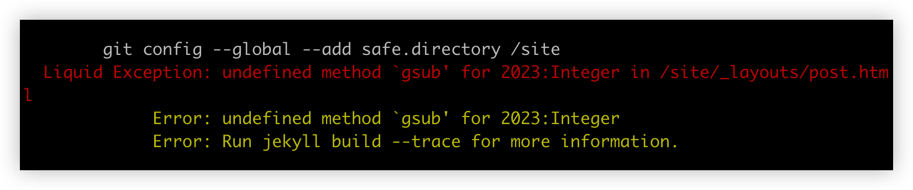

个人博客这个事情，我没少花时间折腾，其中的过程看这几篇文章便可知晓。

- [博客时代虽已没落，但内容创作永远不会过时](https://mp.weixin.qq.com/s?__biz=MjM5MDQ4NjUwMg==&mid=2649196882&idx=1&sn=13943007798535a0b9e54fc1a35ef3a3&chksm=be5733db8920bacdf9878f2810e995fb9afb013974457cfe3980548b8c167c3559ec4eee618e&token=1184766650&lang=zh_CN#rd)
- [我和个人博客那点事儿](https://mp.weixin.qq.com/s?__biz=MjM5MDQ4NjUwMg==&mid=2649198578&idx=1&sn=b4810187f430e2b8cc3f000984dfd07f&chksm=be57357b8920bc6d52c561845afc7b37df37406fe05cb3eeabef2015d6d20bd76166ad9b690e&token=1184766650&lang=zh_CN#rd)
- [再折腾博客](https://mp.weixin.qq.com/s?__biz=MjM5MDQ4NjUwMg==&mid=2649198815&idx=1&sn=0870eec03a4a3ca390ac96634a87ca18&chksm=be572a568920a340de330070cb2465c14d2d0480b51d8e38b704f8bd70bb7306dd6bfcd1b772&token=1184766650&lang=zh_CN#rd)
- [博客自动化部署](https://mp.weixin.qq.com/s?__biz=MjM5MDQ4NjUwMg==&mid=2649198846&idx=1&sn=7c8f0bb6efc0ea791c8fe0e677290867&chksm=be572a778920a3619e0ce85117e91de7a6e1a96f8dce74121bcf2da470a0f6f02e674e3753dc&token=1184766650&lang=zh_CN#rd)

每一次折腾博客，与我而言，都是有益处的。例如：折腾 Hexo 期间，还帮助当时部门搭建起一个小的知识库系统，后来凭借这个小玩意，还为公司拿下一个专利。

再比如最近一次折腾，将个人博客彻底搬到了自建的服务器上，入门学习了 Docker，这个收获也是极大的。

可是，为什么要放弃个人博客呢？

题图中，ChatGPT 总结的那几点还挺不错的，不外乎就是那些原因。但是，下面我想尝试写一些不一样的。

### 玩家心态

年前在处理 side project 一个支线任务的时候，得到某位大佬（独立开发者多年，产出多个产品）的一个提醒：**尽快摆脱玩家心态，做付费产品。**

这些年我也做了一些小玩意，根据自己的一些需求，加上有些许动手能力，便做了很多的 demo 产品，觉得还不错的，便写篇文章，在公众号上分享一下，仅此而已了。

并不是没有想到要做付费产品，作为产品经理，自然也明白，做付费产品，才是检验产品是否有价值的最简单有效的方式。

至于为什么总是走不出那一步，在我心里，一直以来都有两点因素：

1. 产品层面：认为目前做出来的东西，太小众了，且还达不到要跟人收费的标准，但是标准是什么，又不太清晰
2. 技术层面：付费产品的那些基本功能，例如：用户管理，授权，付费等还未完全掌握，而这些功能通常不是产品核心需求，便一拖再拖

这个认知有很大的误区：

一是，过早的担心有没有人付费这一点了，即便没有人付费，也不妨碍要走出这一步；

二是，就算产品考虑全了，该做的功能都做了，达到自己心中所谓的付费标准了，就一定有人付费吗？显然，这个答案也是不确定的。

既然不确定产品是否有价值，也不确认有没有用户愿意付费，那便更应该快速进入付费产品的赛道，快速去做验证，去真实的环境中去感受产品价值、用户价值，而不是像现在，还在等，等考虑清楚了，等功能做完了。

关键是，等考虑清楚了，心性也磨灭得差不多了，好多次「躺平」便是因此。为何总是在说重启 side project 呢，便是之前有过放弃的经历。

简单说便是，**把自己扔到付费产品的环境中，是摆脱玩家心态，迈进独立姿态的最佳路径**。

写作亦是如此。

为何非要等个人博客有了人气之后，再去尝试做付费呢？对于写作来说，放弃搭建个人博客，也是摆脱玩家心态的一步。

### 负收益

另外，搭建个人博客，没有给我带来一丝的回报，这是一笔只赔不赚的事。

PS. 这里的「搭建个人博客」指的是使用自己的服务器、域名，乃至于写作环境，都是个人自建的。

除了域名、服务器等资源的费用之外，光是折腾个人博客系统本身，就占了我很大一部分的时间和精力。

几乎每次更换博客系统，我都要花很多时间调整博客系统的各种配置和样式，而这些内容都与博客内容无关，与写作无关。

除了博客配置和样式这些初始化的调整工作外，还包括电脑系统每次升级导致的本地环境兼容性报错的处理。

而这些工作，某种程度来讲，毫无意义。其实，我之前已经有意识到这个问题了，于是，最近一次的折腾：基于 Docker+Git 的方案，我已经将个人博客的发布流程精简到极致了，每次本地 push 到自建的服务器，博客便自动更新了。

然而，最近一次的推送，莫名其妙报了一个错，是 Jekyll 的报错。

这一次，我没有第一时间去解决问题，而是开始质疑：我为什么还在折腾个人博客？其意义何在？

个人博客到底给我带来了什么？让我不愿意放弃它，还在折腾它。曾经也许对我有很多的帮助，但是，现在没有了。

没有了个人博客，一点也不会妨碍我写东西。难道是为了情怀？而情怀又能值几个钱？自己已经不是当年那个小伙了，还在谈情怀，就显得很不成熟了。

现实点，谈点商业意义吧。

### 知识付费

其实，早在五年前，我便开始尝试知识付费了，最开始是在 GitChat 的一个平台上写技术类文章。作者可自行给每篇文章定价，同时，还能收到平台的会员费分成，在当时，还算比较新颖的一种知识付费的方式。

我总共才写了 4 篇付费文章，便大概有近 800 块钱的收益，相比个人博客的负收益，这简直是不能再香了。

PS. 下图是当时写总结时保存下来的图片，最后注销了账号，平台已经登不上去了。

后来，在小专栏平台上，开通了一个付费专栏，分享了一些文章，也获得了近 300 块的收益，中间一度断更，有些抱歉，但后面，我会重新更新起来的。还是那句话，平台不倒，更新不断，当然，即便哪天平台不在了，依旧可以找到我。

其实，分享在上面的文章，我在博客上也同步发布了，但这并不是割韭菜行为（我在专栏介绍里有过说明），而是订阅者对我的信任，我很珍惜这份信任。

再后来，开通了微信公众号流量主之后，即便是月更，到现在也累计有 130+ 块的收益。

上述这些知识付费的尝试，我收获了：

- 收益
- 订阅者的信任
- 写作的信心
- 反馈

而个人博客，我又获得了什么？

似乎只有这个。