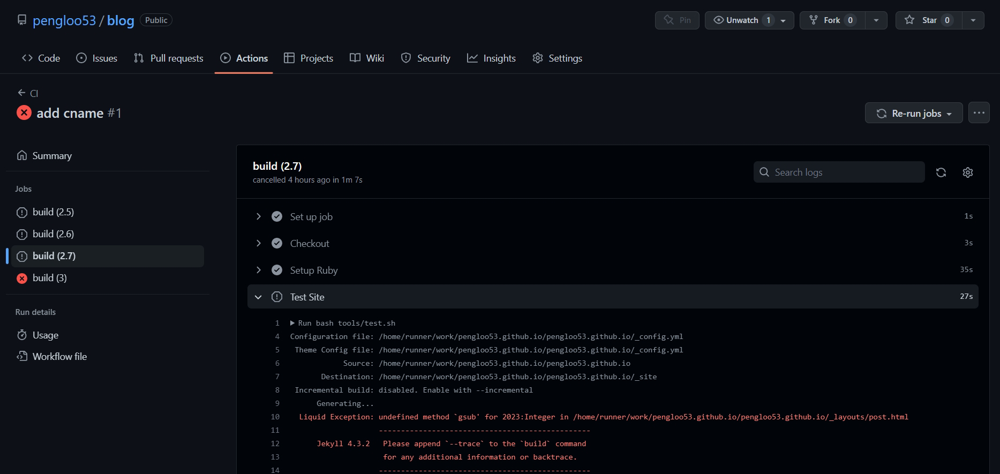
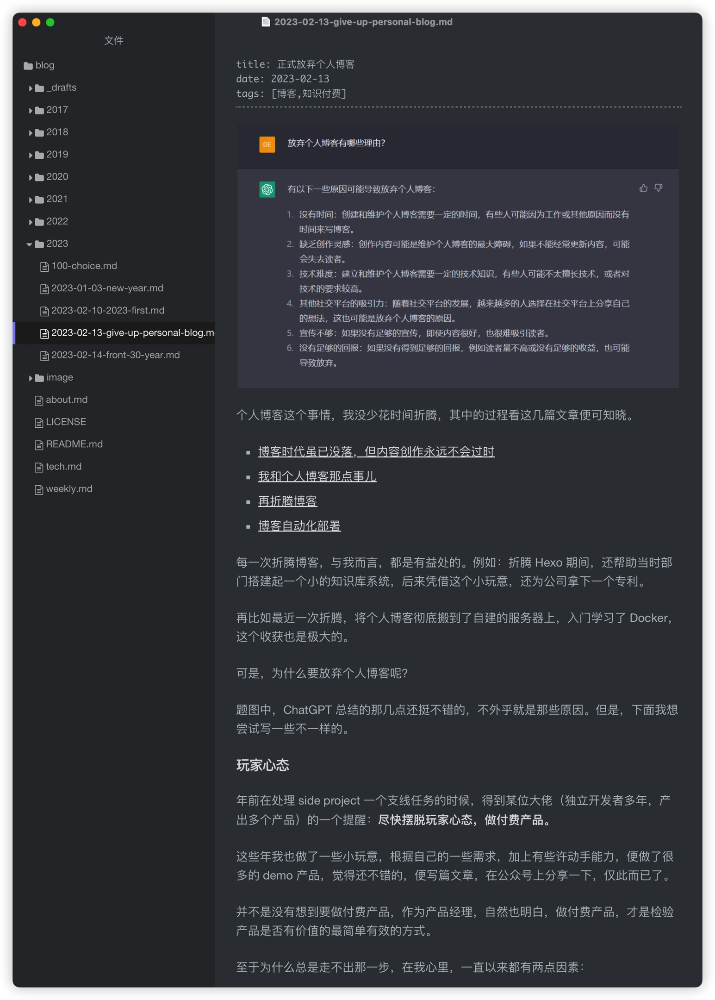
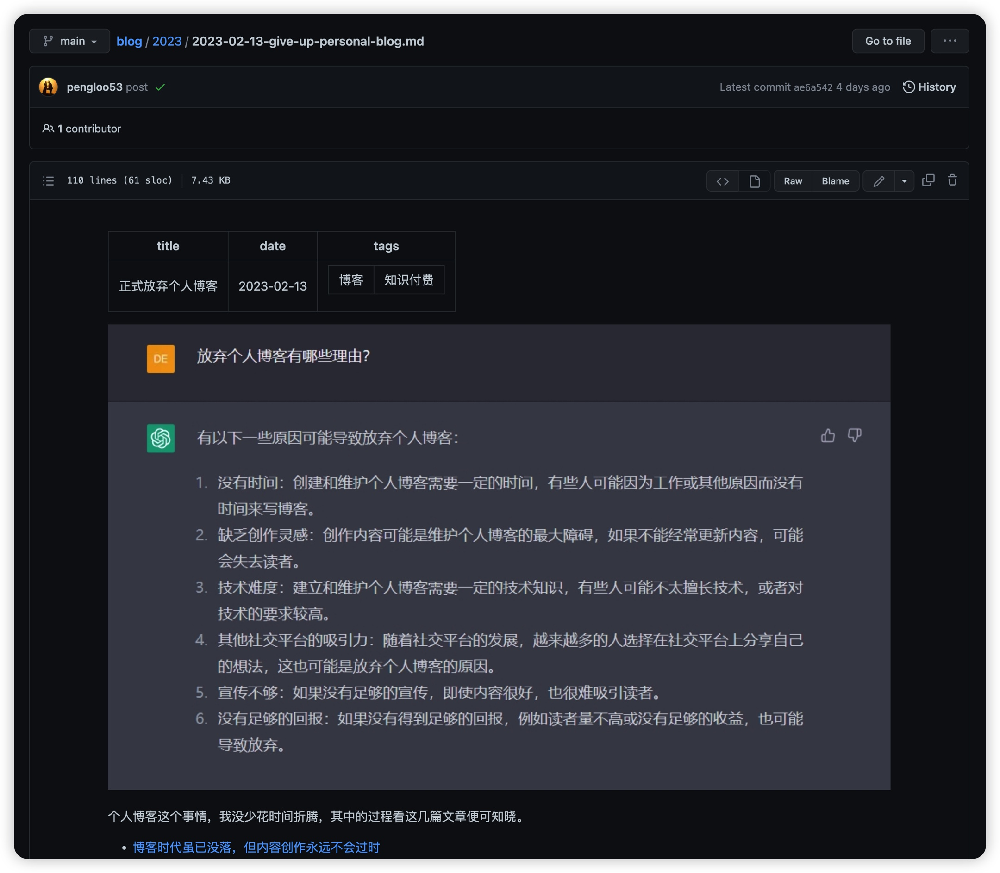
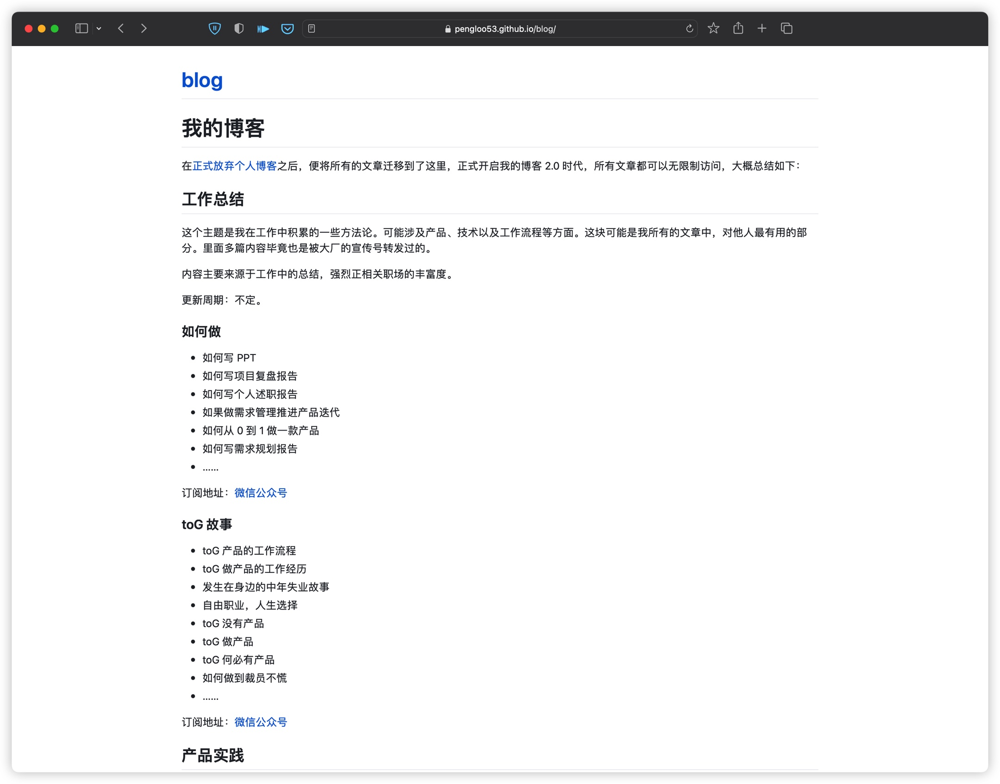
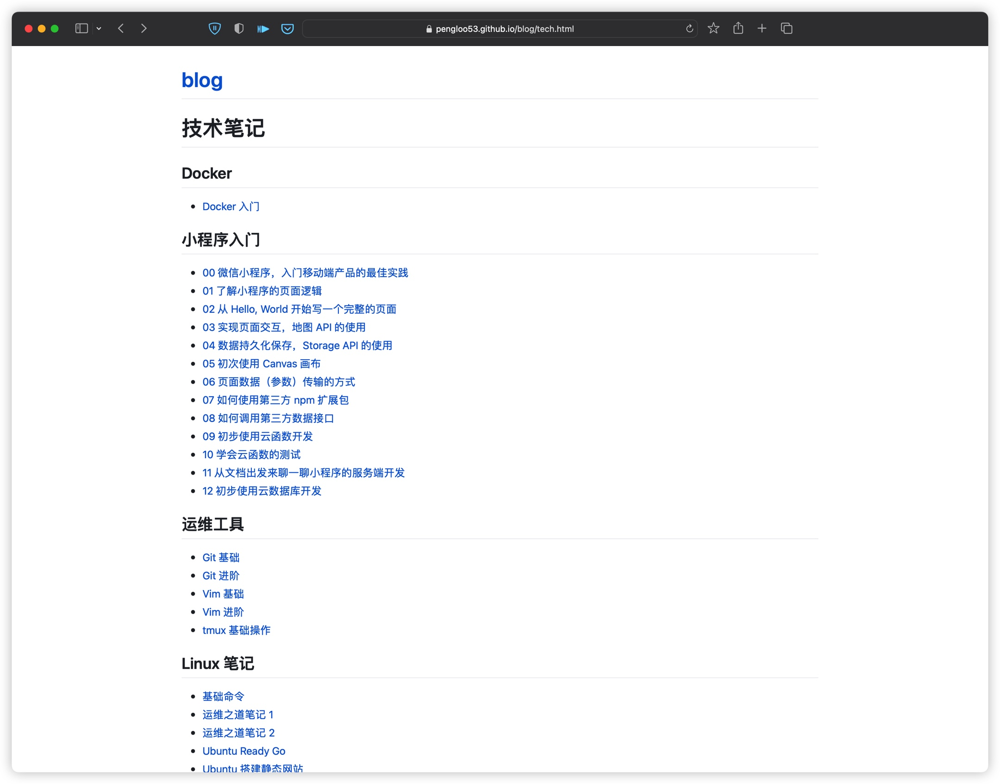
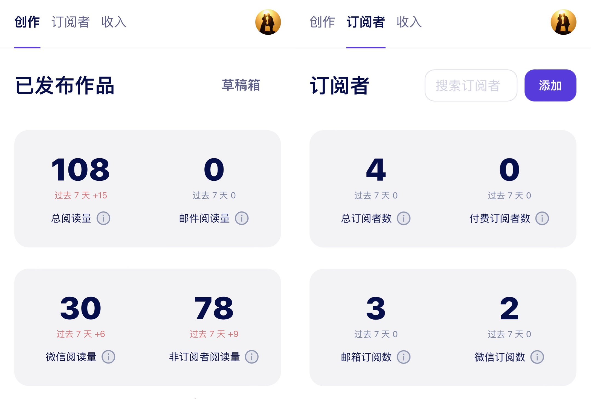

## 一切从简

在放弃个人博客之后，原本是计划将博客推送到 GitHub 上，使用 GitHub Pages 服务取代自己自建服务，这样就可以省下自建服务的资源成本，而且还最大程度保障了博客的访问体验，毕竟还是原主题样式。

然而在将博客推送到 GitHub 上的时候，不出意外的还是报错了。同样的报错，放弃个人博客那篇文章写到过，这个报错是导致我放弃个人博客的导火索。

看报错，似乎是博客主题某个组件和文章内容冲突了，具体原因也不想去查了，果断将博客主题样式所有代码全部删掉了。

只留下了 md 格式的文件以及图片目录，删除了一切与文章内容无关的东西，删完后，整理了一下项目目录，按年归档文章。

然后，写了个脚本，将所有的 md 文件里的图片路径全部替换成了相对路径，这样使用 typora 编辑器的时候，就可以直接看到图片了。

接着，又在 GitHub 上新建了一个仓库，将本地目录推送到了远程仓库托管。在网页上访问 GitHub 仓库的时候，文章内容都正常访问，包括图片展示，效果还是不错的。

最后，意外发现，GitHub 竟然自动将我的 blog 仓库当作项目 Page 了，打开地址一看，效果似乎还可以。

如果我再将一些文章的链接整理放到 readme 中的时候，一个简单的导航页就出现了，就像下面这样：

这是以前鼓捣博客 page 时，留下的 md 文件，直接用上了，是不是效果还不错。

个人博客就应该关注内容就行，要啥主题。

欢迎访问：[https://pengloo53.github.io/blog/](https://pengloo53.github.io/blog/)，你看，自带 https，还不用备案，还不用接受内容审查，还可以使用 issue 进行评论。

## 尝试 Newsletter

上面这种形式的个人博客，其实已经基本够用了，几乎没啥成本，发布文章 push 一下就行了。最关键的是：**所有文件都在本地，云端上的只是备份，顺便生成了一个博客而已**。

有了这个，为什么还要尝试 Newsletter 呢？答案是：获得反馈。

搭建个人博客有 3 层意义：

- 一是，锻炼自己写作能力
- 二是，分享出去，让内容产生价值
- 三是，获得反馈，更好的写作，更好的分享

上面的例子，第一层第二层意义都满足了，但是，缺少有效的反馈。

尝试 Newsletter 也是想要获得反馈，想知道有多少人在看我的文章，哪篇文章更受欢迎，哪些人愿意持续看我的文章（订阅），在这方面，微信公众号是做得非常好的一个平台。

但我还是选择了另外一个平台，作为试验，在选择 Newsletter 平台的时候，主要看了小报童和竹白，看了下申请流程之后，最后选择了竹白，主要原因是：竹白支持免费专栏。

对于个人博客的内容来说，内容原本就是公开的，再弄一个付费的专栏，纯属割韭菜行为了，我不愿意做这个事，况且已经有了一个付费专栏，再没有想好要提供具体什么内容服务之前，不想再弄另外一个付费专栏出来。

贴了几篇最近更新的文章，就已经有 4 个订阅者了，这个数据比以前个人博客的网页统计数据要有用得多。

另外，针对订阅者来说，阅读体验也挺好的，同时支持微信和邮箱订阅，无需用户登录便可直接访问文章，订阅后，文章更新还可推送到微信或者邮箱，读者的体验极佳。

他们也支持会员计划，目前来看，我暂时还用不到，先看数据，后续再考虑也不迟。数据不好，开了也没有任何意义。很喜欢做产品的一句话，大概意思是：让产品的迭代随着数据的增长而自然发生。

## 小专栏

最后这个不想多说，继续为现有订阅的十来个人持续服务，与上面的区别可能就是一个承诺吧。

由于平台许久不更新了，阅读体验也不好，上面已经没啥专栏更新了，不过，我还是那句话，平台不倒，更新不断。

我很珍惜订阅者的这份信任，如果其中订阅者有幸看到这篇文章，可与我取得联系，如果后续我有新的内容付费的会员计划，你们将可以免费获得。