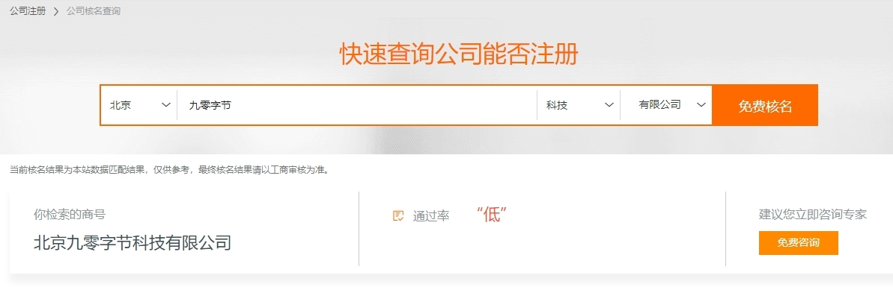
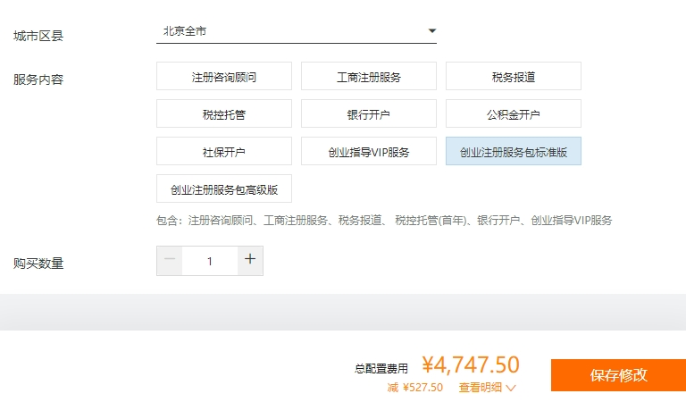
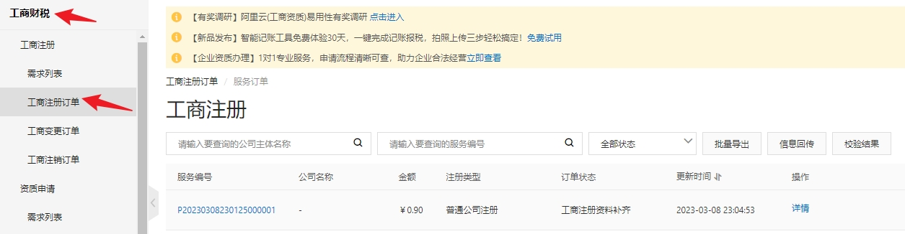
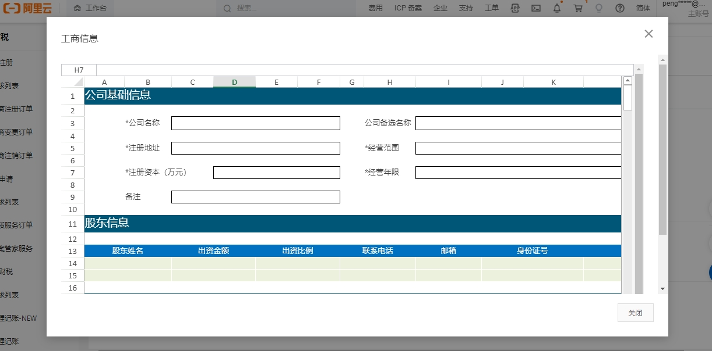

翻看了上周的每日日志，简单总结下：（拖到了周三才差不多写完）

## 工作

这段时间，似乎已经达到自洽的状态，终于从过年假期前后那段时间里解放出来了。

组织架构调整的那段时间真的是一言难尽，公司内部大概可分为三类人：一类直接被干掉了，一类被调整部门了，最后一类被留下「委以重任」。

第一类人无需多说，有人欢喜有人忧，公司还不错，听说是有补贴的；第二类人最爽，又当了一回新员工，犹记得年前我在奋笔疾书写明年规划的时候，他们在玩乐，把我眼红得。而我便是那第三类人，起初还因此沾沾自喜，写下了这篇文章：[裁员不慌的根本原因](https://mp.weixin.qq.com/s?__biz=MjM5MDQ4NjUwMg==&mid=2649198885&idx=1&sn=b42ad1de567dc486deecb57d818825e6&chksm=be572bac8920a2ba6bd6f94cad58253cac08d857ec99d50889e9b138bda1bef5a66170e62cc7&payreadticket=HGWra8Bpo-2eIzr9xMYCwOeZUlQT7CAdyApOCoFm6jkMzzyeOIfAYdi5SxJ8_zXvFUyZyuk#rd)，后面实证是最苦逼的一类人。

公司业绩下行，产品经理属于最尴尬的一类人，开始为了业绩奔波，开始一切为了销售指标，这都是意料之中的事情。在原本的工作基础之上，承担了很多产品营销相关的任务，而原本的产品设计相关任务，只能在各种营销任务的夹缝中生存。

对于一线产品经理来说，是很痛苦的一件事情，而我也并不太擅长市场营销的任务，但好在并不反感，并且还能从与客户经理或者客户的交流沟通中，获得成就感。

但是，问题的关键是，需要在频繁在产品营销和产品设计的任务中切换，便有点吃不消了。上一秒还在跟客户经理吹产品未来规划，这一秒研发一个电话过来，要跟我讨论下这里的超时要设置多少秒。

说回这段时间变得自洽的原因，是因为本周终于有大块的时间去做一些产品设计的任务，来供我消遣了，是的，能有半天的时间，坐在那里画原型，是多么幸福的一件事情。

## AI 助手

自从 chatGPT 发布之后，一下子拉近了 AI 与普通人之间的距离，每个人身边都可以跟一个人工智能助手了。

刚出来那会，还是去年 11 月份，那时，我便开始使用 AI 帮我写代码了，一些逻辑简单的文本处理脚本，使用 AI 很快便可以得到想要的结果，一边打开 chatGPT 的页面，一边打开 IDE 编辑器验证代码。很快便完成了当时一个支线项目的核心代码，简直惊叹 AI 的能力。

随着今年越来越火，chatGPT 的校验越来越严格，一般的梯子都已经上不去了，而后 chatGPT 发布了 plus 会员计划之后，免费版几乎就是不可用状态了。

好在，有了 plus 会员计划以及官方 API 之后，便出现了很多基于 chatGPT 的第三方应用，最近用的比较多的两款是 Emote 和 Poe（暂时免费），都是收费的，但是相比 chatGPT plus 会员要便宜得多了。

除了文本 AI 助手还有图像的，这块我用得不多，便不多说了。

后面我将会尝试使用 AI 帮我完成做一个产品的整个流程，包括 UI 设计。

## 注册公司

上周还有一件事情，那便是注册公司。

注册公司这个事，很久很久之前就想要做了，却一直没有实际行动，主要是因为我知道，注册一个公司并不是关键，关键的是公司要做啥。

这次果断把公司给注册了，并非是想明白了要做点什么，其原因说起来有点可笑，注册公司的原因是想要买一套商用住房。

个人没有购买资格，再买一个住宅吧，又没钱，唯一的途径便是以公司的名义购买。其实，这个事吧，也是可以等等的，虽说未来肯定需要，但并没有这么着急。

在心里琢磨这个事吧，索性就把公司给注册了。

### 注册

起初是在阿里云上查看，之前有了解阿里云推出过公司注册的业务，不用了解具体细节，跟着流程走就可以了。

结果发现还是有点复杂了，一堆模糊概念搞得云里雾里，上来啥也没搞明白呢，就要交钱了。

后来我还是花了 0.9 元，选了个"注册咨询顾问"的服务，才算进入到了他们的工商订单里，第二天客服给我打了个电话，几乎啥也没讲，回答了我几个问题，加了个微信，就再也没有后续了。

第二天找了半天才找到上图这个入口，找到之后，下一步是填写信息，下图这个方式着实有点原始了，阿里云这整个体验真的是太垃圾了，果断决定放弃了。

心想不应该这样，于是，又去支付宝上搜索“注册公司”的关键字，发现了“企小满”这个小程序，跟着引导，没一会就填完了资料信息，最后交了 99 元的注册地址费用，整个流程就结束了。

后面，企小满的客服打来电话，加了微信，确定了公司名字之后，便是线上签署，几分钟就完事了，等了两天，营业执照就下来了。

这个体验就非常好了，这才是正常的代办流程嘛，中间除了起名字之外，基本没花什么时间，这 99 元就感觉超值。

说到起名字这个事，可费了点脑子。

### 起名

那天早上通勤的时候，我便尝试让 AI 帮我起公司的名字，几句询问，围绕九零字节，一下子起了十来个名字。

后来跟企小满的客服对接，发现那些名字一个都不能用，原因基本上就是一个：与其他公司名字类似。发现问题是：九零和字节两个词，基本就注册不了公司了，因为这两个词太过于普通了，类似名字的公司太多了。

然后，开始从姓名着手，奈何媳妇名字里的「云」以及孩子名字中的「玥」同样过于普通，试了一圈都不行，什么云玥，卓玥，飞玥都提示计算机比对不通过。

最后通过的名字叫：晓知玥，读起来还算顺口，那便这样了。要问有什么含义，也算是把媳妇和孩子的名字放进去了吧。

起名字的这个过程让我想起一句话：理想与现实的差距，早上通勤时那一波操作，简直是瞎忙活，还整出 AI 帮我起名字这一出，最后的结果与最初的设想也是毫不相关，这就是现实的骨感。

不过也无所谓了，名字只是一个称呼，况且只是公司的名字，公司名字一般只是隐藏在后台的一个称呼而已，无意义便无意义了，相对而言，产品的名字要更重要一些。