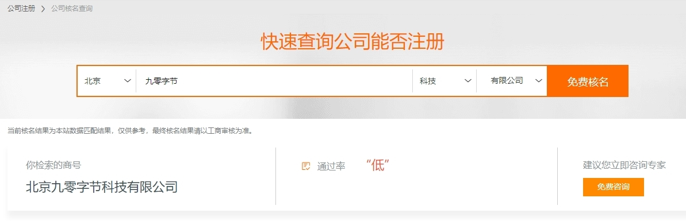
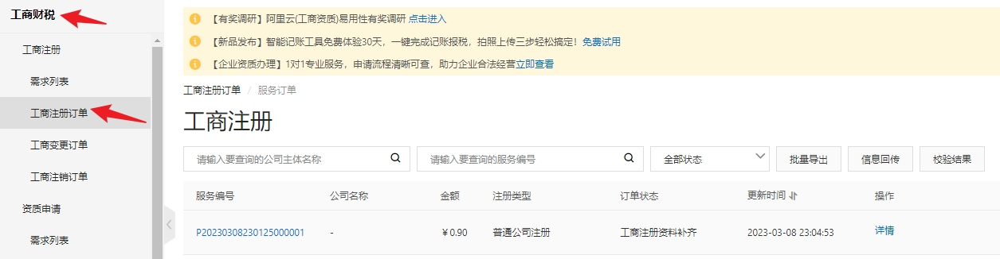
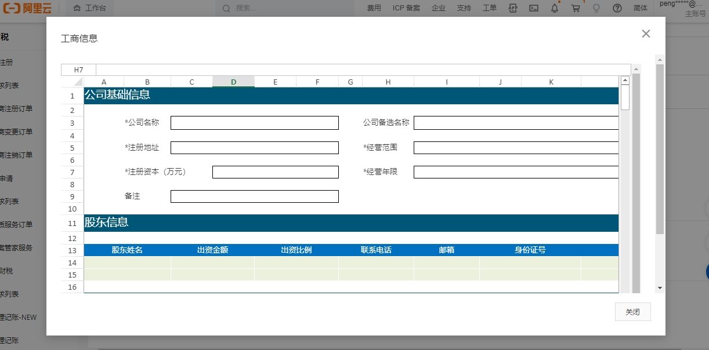

注册公司这个事，很久很久之前就想要做了，却一直没有实际行动，主要是因为我知道，注册一个公司并不是关键，关键的是公司要做啥。

这次果断把公司给注册了，并非是想明白了要做点什么，其原因说起来有点可笑，注册公司的原因是想要买一套商用住房。

个人没有购买资格，再买一个住宅吧，又没钱，唯一的途径便是以公司的名义购买。其实，这个事吧，也是可以等等的，虽说未来肯定需要，但并没有这么着急。

在心里琢磨这个事吧，索性就把公司给注册了。

### 注册

起初是在阿里云上查看，之前有了解阿里云推出过公司注册的业务，不用了解具体细节，跟着流程走就可以了。

结果发现还是有点复杂了，一堆模糊概念搞得云里雾里，上来啥也没搞明白呢，就要交钱了。

后来我还是花了 0.9 元，选了个"注册咨询顾问"的服务，才算进入到了他们的工商订单里，第二天客服给我打了个电话，几乎啥也没讲，回答了我几个问题，加了个微信，就再也没有后续了。

第二天找了半天才找到上图这个入口，找到之后，下一步是填写信息，下图这个方式着实有点原始了，阿里云这整个体验真的是太垃圾了，果断决定放弃了。

心想不应该这样呀，于是，又去支付宝上搜索“注册公司”的关键字，发现了“企小满”这个小程序，跟着引导，没一会就填完了资料信息，最后交了 99 元的注册地址费用，整个流程就结束了。

后面，企小满的客服打来电话，加了微信，确定了公司名字之后，便是线上签署，几分钟就完事了，等了两天，营业执照就下来了。

这个体验就非常好了，这才是正常的代办流程嘛，中间除了起名字之外，基本没花什么时间，这 99 元就感觉超值。

说到起名字这个事，可费了点脑子。

### 起名

那天早上通勤的时候，我便尝试让 AI 帮我起公司的名字，几句询问，围绕九零字节，一下子起了十来个名字。

后来跟企小满的客服对接，发现那些名字一个都不能用，原因基本上就是一个：与其他公司名字类似。发现问题是：九零和字节两个词，基本就注册不了公司了，因为这两个词太过于普通了，类似名字的公司太多了。

然后，开始从姓名着手，奈何媳妇名字里的「云」以及孩子名字中的「玥」同样过于普通，试了一圈都不行，什么云玥，卓玥，飞玥都提示计算机比对不通过。

最后通过的名字叫：晓知玥，读起来还算顺口，那便这样了。要问有什么含义，也算是把媳妇和孩子的名字放进去了吧。

起名字的这个过程让我想起一句话：理想与现实的差距，早上通勤时那一波操作，简直是瞎忙活，还整出 AI 帮我起名字这一出，最后的结果与最初的设想也是毫不相关，这就是现实的骨感。

不过也无所谓了，名字只是一个称呼，况且只是公司的名字，公司名字一般只是隐藏在后台的一个称呼而已，相对而言，产品的名字要重要得多。

### 注册

注册公司除了名字，还有一些信息需要填写，既然自己走过了一遍流程，那便记录下来，希望可以帮到你。

**公司类型**

一般分为个体工商户、个人独资、有限责任公司三类，再具体的信息，我就不太清楚了，自行搜索。

能够在北京买公寓房的，必须是有法人资格的，也就是上面最后一类：有限责任公司，不能是个体工商户和个人独资。

有限责任公司的公司名字一般叫：xx+yy+zz+有限公司，其中：

- xx 是地区，例如：北京、上海；
- yy 是公司名字，自己起的名称；
- zz 是公司所在行业，例如：科技、文化、咨询等等；

其中，xx 可以放到 yy 后面，也可以放到 zz 后面，如果放后面，就要用括号括起来。例如：yy（北京）科技有限公司，或 yy 科技（北京）有限公司。

只有**有限责任公司**的名称才是这么叫，个人独资一般叫：xxx 工作室等等，如果你是独立开发者或者独立设计师的这类手艺人，注册个人独资企业，会更加合适以及划算。

**注册地址**

在北京，不可以选住宅，必须是商用住址才行，这就陷入死循坏了，没有商业地址，不能注册公司，没有公司，不能买商用住房。

其实不是，公司不一定非要拥有房产，相反，租用房产才是最划算的。如果前期几乎没啥业务，甚至租用房产也不需要，选那种一次性注册地址也是可以的。

不过，这类注册地址都是收费的，北京这边需要 2500 左右，上海那边 99 就可以了。

**注册资本**

这个其实并不是很重要，如果只是小规模企业，写上 100 万就可以了，然后定上 30 年后缴纳，至于 30 年后还需不需要缴纳，其实也无所谓了。

**经营范围**

这个其实有固定模版，找同类的公司，照抄就可以了。如果有代办，就像我上面找的企小满，你只需要告诉他们公司具体做啥，他们就会帮你填上。

**股东**

至少两个人，比例自行分配。应该会跟 30 年后认缴有关系。

**企业主要人员**

可以是股东里的人，下面 3 个角色必须要填：

- 法人
- 监事
- 财务负责人

其中，法人和监事不能是同一个人，监事和财务负责人不能是同一个人。如果你们公司就两个人，那么，一个人当法人+财务负责人，另一个人当监事就可以了。

除了上面三个，其他还包括：执行董事、企业秘书、社保缴费经办人、公积金缴费经办人、领票人、联络人。这些在注册阶段可以不填。

### 最后

如果公司名字没有问题，2-3 天就可以拿到营业执照了，再有个 2-3 天就可以拿到印章等材料了。

拿到这些材料，还只是第一步，目前什么业务都还没办法开展，后面还有银行开户、财务记账、税务申报等等，后面再分享。