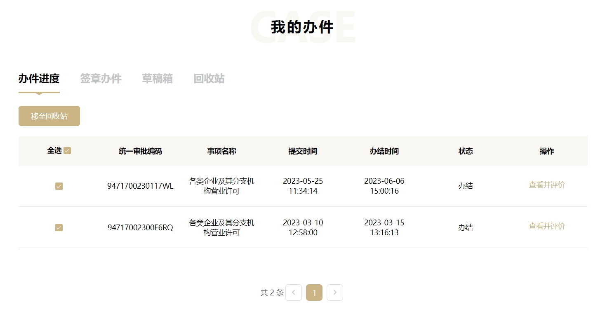

说来有些可笑，注册完公司不到 1 个月时间，就决定要把公司给注销了。

3 月 15 号，注册成功；6 月 6 号，注销成功。全程都在线上操作。

注册找的代理公司，花了 99 元的注册地址费用，其他就没啥了。用了不到一周时间，找代理效率还是要高一些。

注销是按照线上步骤，自己操作的，寄回营业执照花了 20 元快递费，其他没有了。用了一个多月时间，时间稍微长了点，但主要是我的原因，材料填写有问题，来回修改了两三次。

总体来说，不管是注册还是注销，都比较顺畅，几乎没操什么心，也没花费啥钱，就完事了。这一点上，还是要给国家政务服务点赞的。

## 为什么要注销

其主要原因是：**银行开户受阻。**国家在大力精简工商业务流程的时候，银行似乎并不买单。

在拿到公司营业执照和公章之后，我便开始着手银行开户的事。PS. 真不是为了玩。

第一想到的银行是：中国银行。

据说大多数中小企业都选择它，给银行企业业务客服打去电话，客服似乎对具体业务并不熟悉，很多问题模棱两可，例如：外地企业能不能在北京开户？没有实际办公地址能不能开户？如何开户？

后来又去了建设银行柜台，面对我的问题，前台说不清楚，递给我一个客户经理的名片。让我给客户经理打电话，客户经理直接回复：外地公司无法开户。

连续两家受阻，我便询问了当时协助注册公司的代理公司，他们让我多问几家银行再试试看。

抱着试一试的态度，我又给招行的客服打去电话，给的回复也是差不多的。大体意思就是外地公司无法开户，当问到为什么的时候，也是回答不清楚。或许压根就不想受理像我这样的特殊个例吧。

到这里，我才发现：**注册公司容易，银行开户难。**

## 银行开户

银行给企业开户，有个绕不过去的验证流程：需要客户经理去现场考察，并拍照留证。

主要看两点：

1. 实际办公地址在哪？
2. 是不是正常经营？

但是，实际办公地址具体指的是什么？比如：个人住宅能不能作为实际办公地址？怎么才算是正常经营？诸如这些问题，是没有标准答案的。

那正常的情况是怎样的？正常情况就是：你在当地注册的公司，并且在当地有商用地址用来办公，这样才算满足银行开户的准入条件。

而我是个例。

## 特殊情况特殊处理

公司是在网上找代理注册的，地址是那种一次性的注册地址。PS. 这是合法的。没有商用住址，人又在异地，想要在异地银行给公司开户。

你看，我这情况就比较特殊了。银行客服回答不清楚，也很正常了。

但是，我总觉得这个事肯定是可行的，因为类似的场景很常见啊，国家不可能一刀切的禁止。

试想：一个初创公司，前期可能只有一两个人，没有商用的办公地址，不是很正常吗，这种情况难道就不允许开展业务了？

至于实际经营地址，也能解释得通，像互联网这类线上就能处理的业务，一台电脑，一个座位就能办公，根本也无所谓经营地址。

连续几家银行受阻之后，我便隐约地觉得，我这样的特殊情况，正常流程肯定是没办法处理了。

那就只能私人渠道问下了，我咨询了一个在做工商记账业务的朋友，他的答复是：可以开户。

只是，因银行而异。也就是说，能不能开户取决于地方银行是否接受，甚至同一家银行的不同支行，再甚者，取决于客户经理，同一家支行的不同客户经理，可能结果都不一样。

往往办事情，难就难在这些环节，办事情从来都不怕那些繁琐的规章制度，就怕没有。没有制度，没有标准，那就只能靠关系了。为啥总是强调人脉的重要性，就是这个道理。

## 可以开户

经过验证，我的判断是没有问题的。我这特殊情况，是可以开户的。

但前提是得找到受理这种情况的银行，以及对应的客户经理。

最后托那个朋友的关系，找到招商银行一个分行的客户经理，说是可以找人在公司注册地址门前拍一个照片（因为异地，需要证明公司注册的合法性），另外，银行客户经理再上门，拍一个实际办公地址的照片（可以是家里，在电脑前贴上营业执照的那种，证明公司正常经营），这样就可以了。

另外，还跟我说了异地公司开户的问题，唯一的差别就是税务这块，银行不能代扣，需要去本地手动缴纳，其他没啥影响。

不过，最终我还是放弃了，经历了这档子事，隐隐觉得后续会有更多麻烦，还不如在本地注册一个公司了。

## 最后

以上描述，仅针对上海公司要在北京银行开户的这一个场景。不同地区，由于政策差异，可能不一样。

说到地区差异性，我发现上海公司的注册流程是最便利，效率最高，并且成本最低。

我甚至都觉得，注册地址在上海应该都是免费的。在北京就远没有这么便利，光是注册地址在北京就要 2000+，这还得看位置在哪里。

