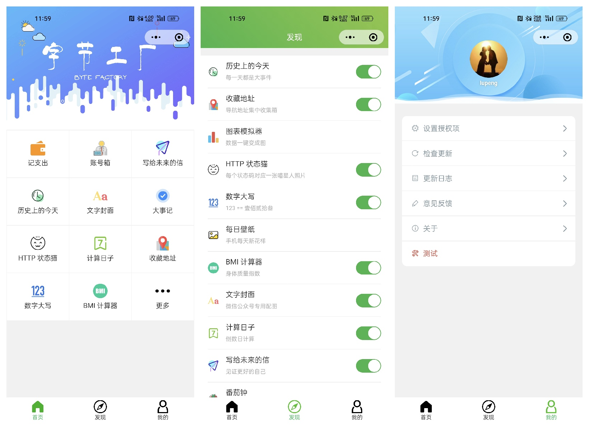
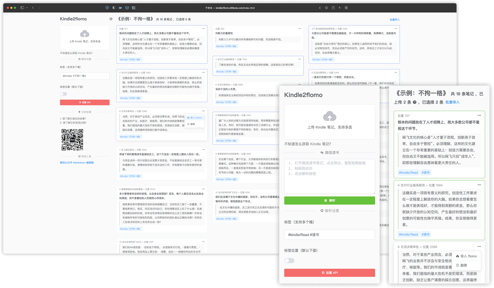
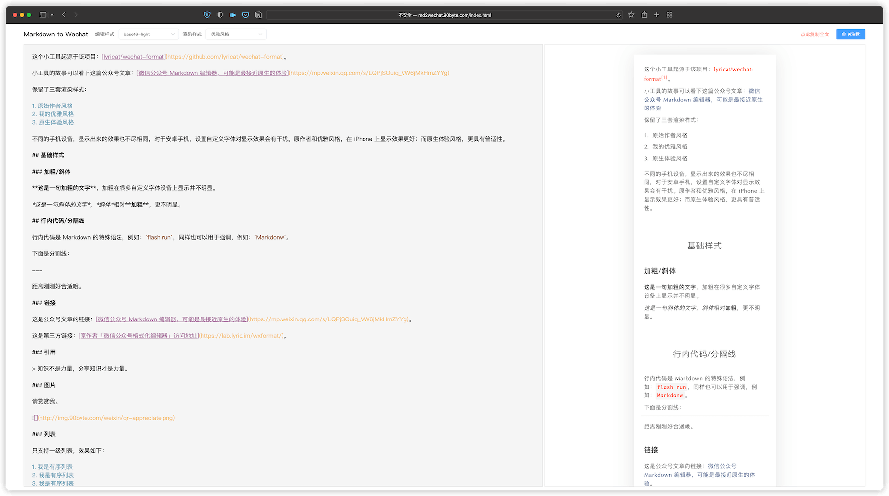

# 我的博客

在[正式放弃个人博客](https://mp.weixin.qq.com/s?__biz=MjM5MDQ4NjUwMg==&mid=2649198901&idx=1&sn=a0c470aed46e674a9e7f564ebdf36e36&chksm=be572bbc8920a2aad96663dd1200d84ee12cd49b2f3f6df031d8b85d4c7c34ff7ad814ca7d9c#rd)之后，便将所有的文章迁移到了这里，正式开启我的博客 2.0 时代，所有文章都可以无限制访问，大概总结如下：

## 工作总结

这个主题是我在工作中积累的一些方法论。可能涉及产品、技术以及工作流程等方面。这块可能是我所有的文章中，对他人最有用的部分。里面多篇内容毕竟也是被大厂的宣传号转发过的。

内容主要来源于工作中的总结，强烈正相关职场的丰富度。

更新周期：不定。

### 如何做

- 如何写 PPT
- 如何写项目复盘报告
- 如何写个人述职报告
- 如果做需求管理推进产品迭代
- 如何从 0 到 1 做一款产品
- 如何写需求规划报告
- ......

订阅地址：[微信公众号](https://mp.weixin.qq.com/mp/appmsgalbum?__biz=MjM5MDQ4NjUwMg==&action=getalbum&album_id=2027947903146590214#wechat_redirect)

### toG 故事

- toG 产品的工作流程
- toG 做产品的工作经历
- 发生在身边的中年失业故事
- 自由职业，人生选择
- toG 没有产品
- toG 做产品
- toG 何必有产品
- 如何做到裁员不慌
- ......

订阅地址：[微信公众号](https://mp.weixin.qq.com/mp/appmsgalbum?__biz=MjM5MDQ4NjUwMg==&action=getalbum&album_id=1583605393820286976#wechat_redirect)

## 产品实践

这里记录我做过的一些小玩意。

### 字节工厂

这是一个微信小程序，搜索【字节加工厂】，便可找到。

它是一个小工具合集，2019 年在家待业那几个月鼓捣的，看了几本小程序开发的书籍，学习过程中，并尝试做了这个小程序，自我感觉还不错，从想法、到设计、到研发、到上线，过程还是挺享受的。只是现实是残酷了，所有时间铺在这么个毫无收益的事情上面，注定是无法持久的。

一边学习，一边写代码，一边总结，那几个月的时光至少还是很充实的。最后输出了一个[入门教程](https://github.com/pengloo53/miniprogram-articles)，作为它最后的收场。

### Kindle2flomo

访问地址：[https://90byte.com/kindle2flomo](https://90byte.com/kindle2flomo)

这是一个将 Kindle 读书笔记一键导入到 [flomo](https://flomoapp.com/) 中的小工具。下面是做这个小工具的一些记录：

- [详谈 Kindle 读书笔记的导出](http://mp.weixin.qq.com/s?__biz=MjM5MDQ4NjUwMg==&mid=2649198191&idx=1&sn=95c506dde4a079d2840a91b12ca358a8&chksm=be5734e68920bdf04af5ad5f31d8c40acea17e723b1b0eeaa2d3d47d009a0adc5abca44bc953#rd)
- [Kindle 笔记一键导入 flomo](http://mp.weixin.qq.com/s?__biz=MjM5MDQ4NjUwMg==&mid=2649198220&idx=1&sn=5d0fecf4d3a4ab1469724292dad9797d&chksm=be5734058920bd13ac17f149d7a54dd01b17a066d70f55a813ebb338075b6837f6c6605b255b#rd)
- [聊一点 kindle2flomo 技术相关的东西吧](http://mp.weixin.qq.com/s?__biz=MjM5MDQ4NjUwMg==&mid=2649198238&idx=1&sn=31d5111d4a3bdc65ab1283612f1427f1&chksm=be5734178920bd0117a068f2c73897fd05c37bddba78efd62ccdf2bb6df5a0386172a4499143#rd)
- [kindle2flomo 2.0 帮助你提高写读书笔记的效率](https://mp.weixin.qq.com/s?__biz=MjM5MDQ4NjUwMg==&mid=2649198375&idx=1&sn=7e50878c8e7046293a84b64bdec89918&chksm=be5735ae8920bcb87a66306af0038d29d265750d13136ce067887e129edf9c95051d509cc4d5&token=1584174037&lang=zh_CN#rd)
- [kindle2flomo 更新一二事，适配移动端](https://mp.weixin.qq.com/s?__biz=MjM5MDQ4NjUwMg==&mid=2649198414&idx=1&sn=33fd4821387b8ad50190cef56de5d38d&chksm=be5735c78920bcd13e4f18262d5f0853b979ba4744f4ffed565b366ca4ebf28042ef88d280e6&token=1584174037&lang=zh_CN#rd)

随着 Kindle 中国的关闭，这个工具大概率不会更新了。但可能会出现新的工具：基于它的读书笔记产品。

重学 Vue 的契机，重构了该项目，看这篇文章：[Kindle2flomo 最终版发布](https://mp.weixin.qq.com/s?__biz=MjM5MDQ4NjUwMg==&mid=2649198863&idx=1&sn=17b5b27f4ad52ca2841b17692d7073b9&chksm=be572b868920a290cf13cbd69cf77ad955a96042a8a5d6fb9a5f0e89b1fafec423ff311e3b16#rd)。

### MD2Wechat

> 已经停止服务，推荐使用：[Markdown Nice](https://editor.mdnice.com/)

这是一款针对微信公众号发文的 Markdown 在线编辑器。

很早之前根据一个开源项目改的，前段时间因为某些原因又拿出来完善了一下，顺便加了图床的功能，为了满足自己发公众号的需求。

关于它的几篇记录：

- [为了用 Markdown 写微信公众号，自定义了一个编辑器](https://mp.weixin.qq.com/s?__biz=MjM5MDQ4NjUwMg==&mid=2649197117&idx=1&sn=90616fd84e3a34bb9dc98dbbf27ee565&chksm=be5730b48920b9a25d4ddf9f2dd87bbcc61045d7bd160b4c7da0ae2c474d7cc91ca98732c340&token=2051922549&lang=zh_CN#rd)

- [微信公众号 Markdown 编辑器，可能是最接近原生的体验](https://mp.weixin.qq.com/s?__biz=MjM5MDQ4NjUwMg==&mid=2649198509&idx=1&sn=dc73a7bce4836d6648d7a4f8c8f0ff49&chksm=be5735248920bc322774cd6bce06bcc8553aa67c0b4745a40170762eed3704e0e1603f61bb14&token=1584174037&lang=zh_CN#rd)

### 技术笔记

最初决定离开职场，原本是打算开始写教程的，结果还是草率了。

这个领域需要付出的努力，远非我所能想象。尝试写过几份教程，没有一个完成，不管哪方面的原因，至少证明自己不是这块料。是时候祭出这篇文章了：[一坑未平，多坑再起](https://mp.weixin.qq.com/s?__biz=MjM5MDQ4NjUwMg==&mid=2649197822&idx=1&sn=df72505e9da6dcb09a3f3e70ede9c0c5&chksm=be5736778920bf615e09f9260e42620980b10bedca2e24adf50d8d7cfb1cb3467a02e59c4491#rd)。

这次也将博客里与技术相关的文章整理了下，[点击这里](tech.md)，技术并非我所擅长，也无心专研，只是自由产品之路上的附属品罢了。

---

[关于作者](about.md)
