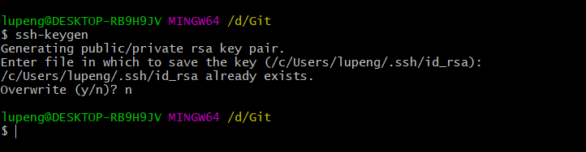
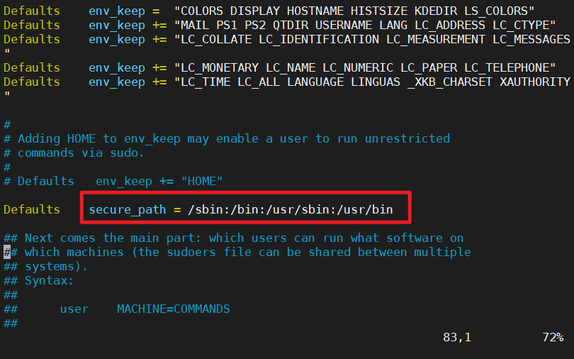

### SSH 密钥登陆服务器

#### 生成公钥

在本地终端，输入 `ssh-keygen` 命令后，一路回车就可以了。

Windows 电脑建议提前安装 [Git 客户端](https://gitforwindows.org/)，千万别用 cmd 来操作。



然后就可以在用户根目录下找到 `.ssh` 目录了，里面有一个 `id_rsa.pub` 的文件，就是本机的公钥了。

#### 复制公钥

复制的话，用下面这个命令把它拷贝一份到 D 盘根目录上。

```shell
cat ~/.ssh/id_rsa.pub > /d/1.txt
```

复制内容，贴到 `Github-Setting-SSH and GPG keys` 里面，就可以不用密码 push 代码了。

如果把它放到服务器上，就可以不用密码登陆服务器了，怎么把公钥上传到服务器上？很简单，只需要下面这条命令就可以了。

```shell
ssh-copy-id -i ~/.ssh/id_rsa.pub root@xxx.xxx.xxx.xxx
```

原理就是在把公钥内容，复制到了服务器上 root 用户 `.ssh` 目录下的  `authorized_keys` 文件里。

好了，可以尝试 `ssh root@xxx.xxx.xxx.xxx` 登陆服务器了。

### 配置网络

如果是在云服务商购买的云服务器，默认你的网络是正常的。

### 下载软件

#### CenOS 8 yum 失败

[完美解决CentOS8 yum安装AppStream报错，更新yum后无法makecache的问题 - 白_胖_子 - 博客园](https://www.cnblogs.com/bpzblog/p/13918199.html)

[centos镜像-centos下载地址-centos安装教程-阿里巴巴开源镜像站](https://developer.aliyun.com/mirror/centos)


#### 安装 Git、Nginx 以及 tmux

很简单了，`yum install -y git nginx tmux`  就可以了。


## 常用命令查询

以下都是针对 CentOS 环境下命令。

### 基本信息

查看 Linux 内核版本

- cat /proc/version
- uname -a

查看 Linux 发行版

- cat /etc/issue

- cat /etc/redhat-release

- lsb_release -a

### 常见错误

#### sudo：command not found

1. 没有安装，`find /etc/sudoers.d`，安装 `yum install sudo`
2. 没有配置路径，找不到对应程序。特征：直接能运行，加上 `sudo` 报错

编辑 `/etc/sudoers`，将命令的路径添加到安全路径中。



### 检查端口

远程机器上检测命令：`telnet ip port`

```bash
systemctl status firewalld    # 查看防火墙的状态
systemctl start firewalld    # 开启防火墙
systemctl stop firewalld    # 关闭防火墙
```

### 卸载软件

```bash
# 如果是 yum 安装的，使用 yum 来卸载
yum search xxx # 查询
yum list # 所有
yum list updates # 可更新列表
yum list installed # 已安装列表
yum list extras # 排除 yum repository 范围外的已安装的软件
yum remove xxx # 卸载
yum clean all # 清除缓存


# 如果是 rpm 安装的，使用 rpm 卸载
rpm -qa | grep xxx # 查询是否安装
rpm -e xxx  # 卸载
rpm -e --nodeps xxx  # 强制卸载
```

