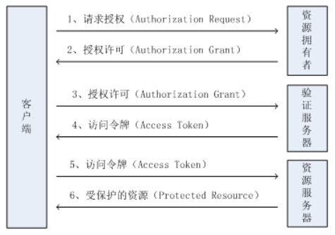

### HTTP Basic Auth

- 提供账号密码
- 适用于登录界面的情况

### Session

- 依赖 Cookie
- 服务器端为每个用户生成唯一的 Session ID，同时，在浏览器端生成对应的 Cookie 与之对应
- 浏览器端发起请求，服务端检查 Session 是否存在，以此来判断是否在登录状态
- 服务端可设置 Session 的有效期

### Token

- 客户端第一次请求登录后，服务端生成 token 返回给客户端
- 客户端带 token 请求，服务端对 token 进行验证
- 服务端无需存储类似 session 的凭证，减少负载压力，且便于扩展
- 标准化规范 JWT（JSON Web Token）：https://jwt.io/

### OAuth

开放授权标准框架，适用于第三方应用，授权流程图如下：

### JWT & OAuth 2 区别

- OAuth2 用在使用第三方账号登录的情况（比如使用weibo, qq, github登录某个app）
- JWT 是用在前后端分离，需要简单的对后台API进行保护时使用。(前后端分离无session, 频繁传用户密码不安全）

OAuth2 是一个相对复杂的协议, 有4种授权模式， 其中的 access code 模式在实现时可以使用 jwt 生成 code， 也可以不用，它们之间没有必然的联系。