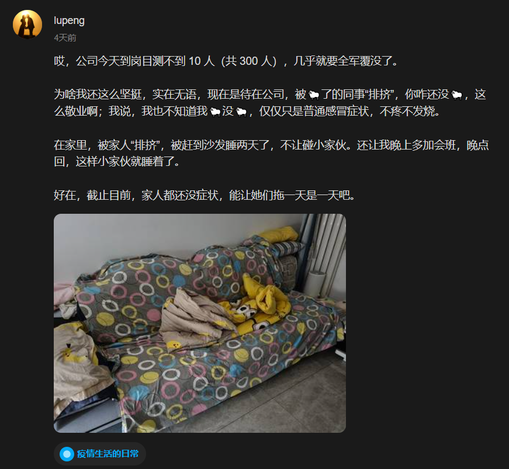

这一周过得异常漫长，感觉时间被拉长了好几倍，因为独处的原因，公司周一周二还有些人，后面几天，基本就没啥人了，由于不确定自己是否被感染，回到家里也基本是独处的状态，一个人的时候，就会觉得时间过得非常慢。

## 工作

### 苟活的打工人

上周的时候，组织架构基本就调完了，来公司一年多了，我的岗位终于调过来了。我终于不再是职位显示的是**解决方案经理**，岗位挂着**规划工程师**，实际干着**产品经理**活的那个状态了。

工作内容总体不变，只是配合的项目经理变成了之前的上级，他的岗位也算是确定了，不用再跟我抢产品经理的活了。不管是面向市场，还是面向研发，都跟他没关系了，都是我的，按照公司项目经理岗位的定位，他变成了接活（产品需求），然后安排研发（人员管理），完成任务就行了。

这个转变，我也跟他简单聊了下，听出来的尽是无奈，一个为了生活苟活的打工人罢了。

### 相互画饼

这周的工作内容，大抵上就是画饼，相互画饼。领导给我们画饼，我们再给领导画饼。

周一的时候，开了一个新部门的启动会，部门老二简单念了下此次调整组织架构的红头文件，然后，老大致辞“打了会鸡血”，便结束了，好在占用时间不长，还未让人感到厌烦。

接着，便是周二晚上的产品规划评审会了，各产品经理都要拿出明年的规划内容，也就是要做什么，怎么做，分几步做。

我从组织架构还未调整，便开始准备这块内容，因为我们产品并非全新，上个版本就要发布了，后面做什么，本来就到了该准备的时候了。

周一周二几乎都在写 PPT 了，为了周二晚上的汇报，会议晚上 6 点开始，8 点结束，会议结束，我对这个新部门唯一的一点期望也基本结束了。

当时就发了条动态：

> 今天开完产品规划会，听完其他几个产品经理的汇报以及新领导的点评，对这个新部门基本不抱啥希望了，整个中心就我这一个在售产品，而且还是个半残废，其他的几个产品八字还没一撇呢，关键是听完他们的汇报，依旧一头雾水，莫名其妙，哎，算了，得过且过吧。

也有可能是，跟他们的汇报相比，我准备得有点充分了，而导致心里不太平衡，希望如此吧，whatever.

不过，准备得充分一些，也是有好处的，前期一定要把这个饼（产品规划）画得漂漂亮亮的，领导品尝后觉得不错，好让他放心警惕，不用老是盯着我，要让他相信，这个工作交到我手上，绝对没问题，这样我不就有时间摸鱼了不是。

PS. 唉，简直不能再油条了。

## side project

这周的摸鱼条件相当完美，整个公司目测不超过 10 人，想怎么摸鱼就怎么摸鱼，只是，效率不是很高，因为少了明确的目标，东一榔头西一棒子的，印象里很大一部分时间都花在了鼓捣开发环境上了。

好在周四周五有一些进展，第二个支线项目一下子完成了一大半的编码工作，其中关键因素是：[chatGPT](https://chat.openai.com/)。

那天下午，鼓捣开发环境的时候，闲之无事，突然冒出个念头，能不能让 chatGPT 帮我写代码。这个项目的核心业务逻辑，都想好了，甚至实现过程，我都记下来了，就差编码实现了，让 chatGPT 来帮忙写，最适合不过了。

于是，打开 chatGPT，一句一句的引导，然后贴到开发环境中验证，如果报错了，我就直接把报错再发给它，它纠正后，我再贴到 IDE 中，就这样，服务端的核心代码，它基本上帮我写完了。

前端这块，主要是选 UI 组件调样式，就自己上了，正好刚学完 Vue3，再巩固一下。

花了两个下午的时间，基本就完成了，这速度简直了，关键是，服务端的代码我根本就不会，还没来得及学习，就这样搞定了。

这感觉，就像给自己雇了个程序员似的，简直不能爽了。

这个支线项目纯粹就是为了满足自己的一个非常小众需求，目前还没办法提供给他人使用，先不做介绍了。

这次的重点并不是这个支线项目，而是，它是由 [chatGPT](https://chat.openai.com/) 帮我完成的，这个奇妙的经历，后面再单独写一篇文章分享。

## 生活

由于不知道自己是否被感染（只是时不时的咳嗽，不疼不发烧），而又因为家里有小孩子，所以，本周我几乎没有多少时间在家里，周末也是在公司渡过的。这感觉实在是别扭，不上不下，不里不外的。

